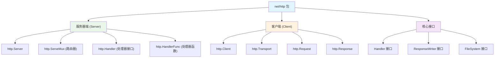
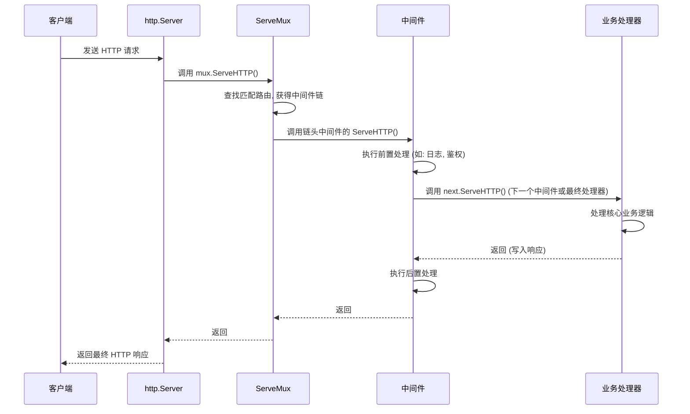

# Go `net/http` 包综合学习指南

本文档合并并组织了多份学习笔记，旨在提供一份关于 Go `net/http` 包的全面、结构化的学习指南，内容涵盖从核心概念到高级特性与最佳实践。

## 1. 整体架构概览

Go 的 `net/http` 包基于“小接口，大组合”的设计哲学，整个生态系统都围绕着几个核心的、可组合的类型构建。



## 2. 核心接口设计：`net/http` 的基石

`net/http` 包的强大与灵活源于其精妙的接口设计。

### 2.1 `http.Handler` - 整个包的灵魂

```go
type Handler interface {
    ServeHTTP(ResponseWriter, *Request)
}
```
这是 `net/http` 中最重要的接口。任何实现了 `ServeHTTP` 方法的类型，都可以被视为一个 HTTP 处理器，能够接收请求并构建响应。

### 2.2 `http.ResponseWriter` - 响应写入器

```go
type ResponseWriter interface {
    Header() Header                // 获取响应头，用于设置 Header
    Write([]byte) (int, error)     // 写入响应体
    WriteHeader(statusCode int)    // 写入 HTTP 状态码
}
```
这个接口作为参数传递给你的处理器，允许你精细地控制返回给客户端的 HTTP 响应。

### 2.3 `http.HandlerFunc` - 天才的函数适配器

```go
type HandlerFunc func(ResponseWriter, *Request)

// 为函数类型实现 ServeHTTP 方法，使其满足 Handler 接口
func (f HandlerFunc) ServeHTTP(w ResponseWriter, r *Request) {
    f(w, r)
}
```
这是 Go 中一个非常巧妙的设计。它是一个函数类型，但同时实现了 `Handler` 接口。这使得我们可以直接将一个普通函数当作 `Handler` 使用，极大地简化了代码。

## 3. 服务器端实现

一个完整的 Web 服务端通常由三部分构成：`http.Server` 负责监听和管理连接，`http.ServeMux` (路由器) 负责分发请求，而 `http.Handler` 负责处理具体的业务逻辑。

### 3.1 `http.Server` - HTTP 服务器

```go
type Server struct {
    Addr         string        // 监听地址，如 ":8080"
    Handler      Handler       // 根处理器，所有请求的入口
    ReadTimeout  time.Duration // 读取超时
    WriteTimeout time.Duration // 写入超时
    // ... 更多高级配置字段
}
```
在生产环境中，强烈建议使用自定义的 `http.Server` 而非 `http.ListenAndServe`，以便进行更精细的超时和安全控制。

**使用示例：**
```go
server := &http.Server{
    Addr:    ":8080",
    Handler: mux,  // 将我们的路由器作为根处理器
}
log.Fatal(server.ListenAndServe())
```

### 3.2 `http.ServeMux` - 请求路由器

`ServeMux`（HTTP 请求多路复用器）是 Go 的内置路由器。
**工作原理：**
1.  接收所有 HTTP 请求。
2.  根据请求的 URL 路径，在内部注册的路由表中查找最匹配的处理器。
3.  调用该处理器的 `ServeHTTP` 方法。

**路由匹配规则：**
-   **精确匹配**：如 `/api/health`，只匹配该路径。
-   **子树路径匹配 (前缀匹配)**：以斜杠 `/` 结尾，如 `/static/`，会匹配所有以 `/static/` 开头的路径（例如 `/static/css/main.css`）。
-   **最长匹配优先**：如果多个模式匹配，选择最长的那个。`/static/images/` 会优先于 `/static/`。
-   **根路径匹配**：`/` 会匹配所有其他模式未能匹配的请求。

**使用示例：**
```go
mux := http.NewServeMux()
// 使用 HandlerFunc 适配器注册一个函数
mux.HandleFunc("GET /api/v1/health", healthCheckHandler)
// 注册一个实现了 Handler 接口的实例
mux.Handle("/app/", http.StripPrefix("/app/", http.FileServer(http.Dir("./static"))))
```

### 3.3 文件服务器功能

`net/http` 内置了强大的静态文件服务能力。
-   `http.FileServer(root FileSystem) Handler`：创建一个文件服务器处理器。
-   `http.Dir(string)`：将一个本地文件系统目录适配成 `http.FileSystem` 接口。

**使用示例：**
```go
// 创建一个处理 "./public" 目录下文件的 Handler
fileHandler := http.FileServer(http.Dir("./public"))
// 将请求路径 /static/ 映射到文件系统的根目录
mux.Handle("/static/", http.StripPrefix("/static/", fileHandler))
```

### 3.4 常用的服务器端辅助函数
-   `http.Redirect(w, r, "/new-path", http.StatusMovedPermanently)`：执行 301 重定向。
-   `http.Error(w, "权限不足", http.StatusForbidden)`：便捷地返回一个错误响应。
-   `http.NotFound(w, r)`：返回标准的 404 Not Found 页面。
-   `http.SetCookie(w, &cookie)`：向客户端设置 Cookie。

## 4. 客户端实现

`net/http` 同样提供了功能完备的 HTTP 客户端。

### 4.1 `http.Client` - HTTP 客户端

```go
type Client struct {
    Transport     RoundTripper  // 底层传输，可配置连接池等
    CheckRedirect func(*Request, []*Request) error // 重定向策略
    Jar           CookieJar     // Cookie 管理
    Timeout       time.Duration // 整个请求的超时设置
}
```
**使用示例：**
```go
// 简单用法 (使用默认客户端)
resp, err := http.Get("http://example.com")

// 生产环境推荐：自定义客户端
client := &http.Client{
    Timeout: 10 * time.Second,
}
resp, err = client.Get("http://example.com")
defer resp.Body.Close()
```

### 4.2 `http.Request` 和 `http.Response`
这两个结构体分别代表了 HTTP 的请求和响应，是网络通信的核心数据结构，包含了方法、URL、头信息、消息体等所有必要信息。

## 5. 中间件模式详解

中间件（Middleware）是 Go Web 开发中最强大、最常用的模式之一。它允许我们将功能像洋葱皮一样层层包裹在核心处理器之外，实现如日志、认证、度量、CORS 等横切关注点。

### 5.1 中间件的核心模式

中间件本质上是一个函数，它接收一个 `http.Handler` 并返回一个新的 `http.Handler`。

```go
type Middleware func(http.Handler) http.Handler
```

**实现示例：日志中间件**
```go
func loggingMiddleware(next http.Handler) http.Handler {
    return http.HandlerFunc(func(w http.ResponseWriter, r *http.Request) {
        // 1. 在处理请求前执行的逻辑
        start := time.Now()
        log.Printf("Started %s %s", r.Method, r.RequestURI)

        // 2. 调用下一个处理器（或中间件）
        next.ServeHTTP(w, r)

        // 3. 在处理请求后执行的逻辑
        log.Printf("Completed in %v", time.Since(start))
    })
}
```

### 5.2 中间件链的构建

多个中间件可以轻松地组合成一条处理链。

```go
// 原始处理器
finalHandler := myAppHandler()

// 链式调用
chain := loggingMiddleware(
    authMiddleware(
        finalHandler
    )
)

mux.Handle("/secure/resource", chain)
```
**执行顺序**：请求会像穿过洋葱一样，按顺序通过 `loggingMiddleware` 的前置逻辑 -> `authMiddleware` 的前置逻辑 -> `finalHandler` -> `authMiddleware` 的后置逻辑 -> `loggingMiddleware` 的后置逻辑。

### 5.3 完整的请求生命周期

下面的序列图清晰地展示了一个 HTTP 请求从客户端发出，到最终返回响应的完整流程，特别是中间件在其中的“承上启下”作用。



## 6. 高级特性

### 6.1 `Context` 支持

自 Go 1.7 起，`http.Request` 包含了 `Context`，用于在请求处理链中传递请求范围的数据、取消信号和超时。

```go
func handlerWithContext(w http.ResponseWriter, r *http.Request) {
    // 1. 从请求中获取 context
    ctx := r.Context()

    // 2. 检查 context 是否已被取消 (例如，客户端断开连接)
    select {
    case <-ctx.Done():
        log.Println("Request cancelled by client")
        return // 提前终止处理
    default:
        // 继续处理
    }

    // 3. 可以派生新的带超时的 context 用于下游调用 (如数据库查询)
    dbCtx, cancel := context.WithTimeout(ctx, 2*time.Second)
    defer cancel()
    // _, err := db.QueryContext(dbCtx, "SELECT ...")
}
```

### 6.2 HTTP/2 自动支持
当使用 `ListenAndServeTLS` 启动 HTTPS 服务器时，Go 会自动为支持的客户端启用 HTTP/2，无需任何额外配置。

```go
server := &http.Server{Addr: ":8443", Handler: mux}
// 启动后将自动支持 HTTP/1.1 和 HTTP/2
log.Fatal(server.ListenAndServeTLS("cert.pem", "key.pem"))
```

### 6.3 优雅关闭 (Graceful Shutdown)
优雅关闭允许服务器在停止前完成正在处理的请求，但不再接受新请求，这对于生产环境的无缝部署至关重要。

```go
func gracefulShutdown(server *http.Server) {
    // 启动服务器
    go func() {
        if err := server.ListenAndServe(); err != nil && err != http.ErrServerClosed {
            log.Fatalf("Server failed: %v", err)
        }
    }()

    // 等待中断信号 (Ctrl+C)
    quit := make(chan os.Signal, 1)
    signal.Notify(quit, os.Interrupt, syscall.SIGTERM)
    <-quit
    log.Println("Shutting down server...")

    // 创建一个带超时的 context 用于关闭
    ctx, cancel := context.WithTimeout(context.Background(), 10*time.Second)
    defer cancel()

    // 调用 Shutdown
    if err := server.Shutdown(ctx); err != nil {
        log.Fatalf("Server forced to shutdown: %v", err)
    }

    log.Println("Server exited gracefully")
}
```

## 7. 最佳实践与总结

### 7.1 结构化应用

为了避免使用全局变量并保持代码清晰，推荐将依赖项（如数据库连接、配置、日志记录器）封装在一个结构体中，并让处理器方法成为该结构体的一部分。

```go
type App struct {
    DB     *sql.DB
    Logger *log.Logger
    // ... 其他依赖
}

// 处理器成为 App 的方法，可以访问 App 的依赖
func (app *App) healthHandler(w http.ResponseWriter, r *http.Request) {
    if err := app.DB.Ping(); err != nil {
        http.Error(w, "Database not available", http.StatusInternalServerError)
        app.Logger.Printf("Health check failed: %v", err)
        return
    }
    w.WriteHeader(http.StatusOK)
    fmt.Fprintln(w, "OK")
}

func main() {
    // 初始化依赖...
    app := &App{DB: db, Logger: logger}

    mux := http.NewServeMux()
    // 注册方法处理器
    mux.HandleFunc("/health", app.healthHandler)
    // ...
}
```


## 关于 context


    ```mermaid
    		graph TB
        A["主 Goroutine"] --> B["创建 Context"]
        B --> C["启动子 Goroutine 1"]
        B --> D["启动子 Goroutine 2"] 
        B --> E["启动子 Goroutine 3"]
    		F["某个 Goroutine"] --> G["调用 cancel()"]
    		G --> H["Context 被取消"]
    		H --> I["所有监听的 Goroutine 收到信号"]
    
    		C --> I
    		D --> I
    		E --> I
    
    		style A fill:#e1f5fe
    		style F fill:#ffebee
    		style H fill:#fff3e0
    		style I fill:#e8f5e8
    ```

