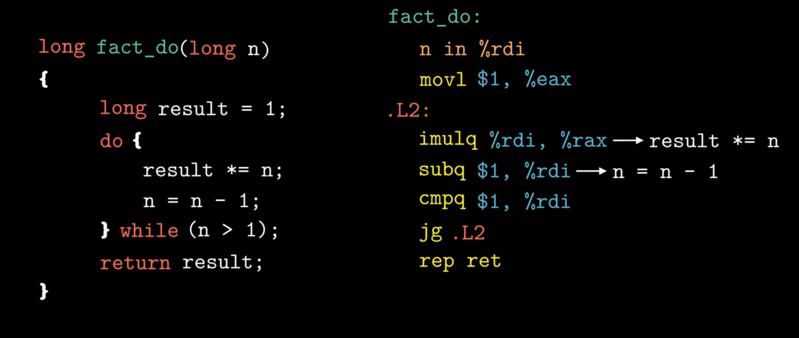

# bomblab前置内容：

1字节(Byte) = **8位(bit)**

**在以下的汇编指令中，带有括号即代表取对应寄存器地址所指的数据，反之则指的是指针地址本身**

**如：subq $16,%rsp 这里是将栈顶指针减去16，相当于在栈上分配了16字节的空间**

## 寄存器：

### 汇编复习

想要完成拆弹任务，不但需要理解不同寄存器的常用方法，也要弄明白具体的操作符是什么意思：

|   类型   |     语法      |                      例子                      |             备注             |
| :------: | :-----------: | :--------------------------------------------: | :--------------------------: |
|   常量   | 符号`$` 开头  |               `$-42`, `$0x15213`               | 一定要注意十进制还是十六进制 |
|  寄存器  | 符号 `%` 开头 |                 `%esi`, `%rax`                 |     可能存的是值或者地址     |
| 内存地址 |  括号括起来   | `(%rbx)`, `0x1c(%rax)`, `0x4(%rcx, %rdi, 0x1)` |   括号实际上是去寻址的意思   |

#### 指令指针寄存器（RIP)：

指令指针是一个寄存器，它包含 CPU 将要执行的下一条指令的地址。它也被称为程序计数器。最初，在 Intel 8086 处理器中（x86 术语的起源），它是一个 16  位寄存器，缩写为 IP。在 32 位处理器中，指令指针变成了一个 32 位寄存器，称为 EIP 或扩展指令指针。在 64  位系统中，这个寄存器变成了一个 64 位寄存器，称为 RIP（这里的 R 代表寄存器）。

**其实就是我们电子电路中学的程序计数器（PC）**

**所以在程序中一般指向程序的起始点0x0000 0000**

#### 通用寄存器组:

通用寄存器组是CPU中用于存储临时数据的寄存器集合，作为处理器与内存之间的高速存储单元，承担了存储操作数、计算结果、中间数据等任务。以下是通用寄存器组的详细介绍，以x86/x86-64架构为例说明。

------

## 一、通用寄存器的组成和功能

在x86和x86-64架构中，通用寄存器可以分为以下几类，分别具有不同的功能和特点：

| **寄存器**     | **16位名称** | **32位名称** | **64位名称** | **主要功能**                   |
| -------------- | ------------ | ------------ | ------------ | ------------------------------ |
| 累加寄存器     | AX           | EAX          | RAX          | 通常用于算术和逻辑操作         |
| 基址寄存器     | BX           | EBX          | RBX          | 用作基址指针                   |
| 计数寄存器     | CX           | ECX          | RCX          | 用作循环计数器                 |
| 数据寄存器     | DX           | EDX          | RDX          | 用于I/O操作和扩展乘法/除法结果 |
| 栈指针寄存器   | SP           | ESP          | RSP          | 指向当前栈顶                   |
| 基指针寄存器   | BP           | EBP          | RBP          | 用作栈帧基指针                 |
| 源地址寄存器   | SI           | ESI          | RSI          | 用于字符串操作的源地址指针     |
| 目标地址寄存器 | DI           | EDI          | RDI          | 用于字符串操作的目标地址指针   |

------

## 二、寄存器的分段访问

在x86架构中，通用寄存器可以分段访问，这种特性使得程序可以灵活地操作寄存器的不同部分。

### 1. **64位寄存器（x86-64架构）**

- `RAX`, `RBX`, `RCX` 等表示完整的64位寄存器。

### 2. **32位寄存器（x86架构扩展）**

- `EAX`, `EBX`, `ECX` 等是寄存器的低32位。

### 3. **16位寄存器（8086架构兼容）**

- `AX`, `BX`, `CX` 等是寄存器的低16位。

### 4. **8位寄存器**

- 低8位：`AL`, `BL`, `CL`, `DL`。（low）

- 高8位：`AH`, `BH`, `CH`, `DH`（仅16位寄存器的高8位，32位及以上寄存器不直接支持访问高8位）。（high）

- 在寄存器命名中，H 和 L 表示寄存器的高8位（High 8-bit）和低8位（Low 8-bit）。这种命名方式用于16位寄存器，指的是将一个16位寄存器分成两个8位部分。
  1. 命名的意义

      H（High）：表示寄存器的高8位，即寄存器的高地址部分，通常是16位寄存器的第9到第16位。
      L（Low）：表示寄存器的低8位，即寄存器的低地址部分，通常是16位寄存器的第1到第8位。

  2. 举例说明

  以 AX 寄存器为例：

      AX 是一个16位寄存器，包含了16位数据。
      AH 是 AX 寄存器的高8位（即 AX 的第9到第16位）。
      AL 是 AX 寄存器的低8位（即 AX 的第1到第8位）。

  类似地：

      BX 寄存器可以被分为 BH（高8位）和 BL（低8位）。
      CX 寄存器可以被分为 CH（高8位）和 CL（低8位）。
      DX 寄存器可以被分为 DH（高8位）和 DL（低8位）。

例如，访问`RAX`寄存器的不同部分：

| **名称** | **宽度** | **描述**                |
| -------- | -------- | ----------------------- |
| `RAX`    | 64位     | 全64位寄存器            |
| `EAX`    | 32位     | 低32位                  |
| `AX`     | 16位     | 低16位                  |
| `AL`     | 8位      | 低8位                   |
| `AH`     | 8位      | 高8位（低16位的一部分） |

------

## 三、寄存器的主要用途

### 1. **累加寄存器（RAX）,** ax代表accumulator register

- 用于算术和逻辑操作。
- 执行乘法、除法等操作时通常会用到。
- 调用系统调用时，`RAX`通常存储系统调用号。
- **用来保存函数的返回值**

### 2. **基址寄存器（RBX）,**bx代表base register

- 通常作为基地址存储指针，用于间接寻址。
- **一般用于存储临时变量**
- **作为遍历指针**（参考bomblab phase 2)

### 3. **计数寄存器（RCX）,**cx代表count register

- 用于循环计数。
- 在字符串操作指令（如`REP MOVSB`）中，`RCX`用于指定操作次数。

### 4. **数据寄存器（RDX）,**dx代表data register

- 用于I/O操作、乘法或除法的扩展结果存储。
- 函数调用时，`RDX`通常存储第三个参数。

### 5. **栈指针寄存器（RSP）,**sp代表stack pointer

- 指向当前栈顶，用于栈操作（如函数调用、返回、压栈、弹栈）。
- 通常由硬件或编译器管理，不直接用于通用数据存储。
- **保存程序栈的结束位置**

### 6. **基指针寄存器（RBP）,**bp代表base pointer

- 指向当前栈帧的基地址，常用于函数调用时访问局部变量和参数。
- 在现代编译器中，`RBP`可能被优化为通用寄存器。

### 7. 源/目标地址寄存器（RSI/RDI）,分别代表source/destination index

- 用于字符串操作：
  - `RSI`：指向源地址。
  - `RDI`：指向目标地址。
- 配合字符串指令（如`MOVS`, `SCAS`等）使用。
- **RDI通常用于存储函数的第一个参数**
- **分配规则，如存在x,y变量时，那么x in RDI, y in RSI**
- 在 x86-64 架构下（遵循 System V ABI 或 Microsoft x64 ABI），函数的参数会通过寄存器而不是栈传递。这大大提高了函数调用的效率。

  对于最多 6 个整数类型参数（例如 `int`），它们将依次通过以下寄存器传递：

  - **第一个参数**：`RDI`
  - **第二个参数**：`RSI`
  - **第三个参数**：`RDX`
  - **第四个参数**：`RCX`
  - **第五个参数**：`R8`
  - **第六个参数**：`R9`

  如果参数超过了 6 个，则剩余的参数会通过栈传递。
  
  对于bomblab phase 3:
  
  📌 **在 x86-64 ABI 调用惯例中，函数的参数存放在以下寄存器中：**
  
  1. `%rdi` - `sscanf` 的第一个参数（字符串输入）
  2. `%rsi` - `sscanf` 的第二个参数（格式化字符串）
  3. `%rdx` - `sscanf` 的第三个参数（第一个输入变量的地址）
  4. `%rcx` - `sscanf` 的第四个参数（第二个输入变量的地址）

------

## 四、寄存器在64位模式下的扩展

在x86-64架构中，除了传统的8个通用寄存器外，又新增了8个寄存器（`R8`到`R15`），使通用寄存器的总数增加到16个。它们的分段访问方式如下：

| **名称**     | **宽度** | **描述**       |
| ------------ | -------- | -------------- |
| `R8`-`R15`   | 64位     | 完整64位寄存器 |
| `R8D`-`R15D` | 32位     | 低32位         |
| `R8W`-`R15W` | 16位     | 低16位         |
| `R8B`-`R15B` | 8位      | 低8位          |

------

## 一、状态寄存器（**EFLAGS** / **RFLAGS**）

**状态寄存器**（在x86架构中称为 `EFLAGS`，在x86-64架构中称为 `RFLAGS`）是一个特殊寄存器，用于存储和控制程序执行过程中的各类标志位和状态信息。它主要由 **标志位** 和 **控制位** 组成，参与程序流的决策和调试。

### 1. **EFLAGS / RFLAGS 结构**

- **EFLAGS**（32位，x86架构）和 **RFLAGS**（64位，x86-64架构）在功能上类似，只是后者的位宽更大（64位），并且包含更多的标志位。

### 2. **常见标志位**

| **标志位** | **位置** | **描述**                                                     |
| ---------- | -------- | ------------------------------------------------------------ |
| **CF**     | 0        | **Carry Flag**：进位标志，指示加法操作中是否发生进位或减法操作中是否发生借位。 |
| **PF**     | 2        | **Parity Flag**：奇偶标志，用于指示运算结果中低位字节的1位数量是奇数还是偶数。（会在cmp中出现） |
| **AF**     | 4        | **Auxiliary Carry Flag**：辅助进位标志，用于BCD（十进制）运算。 |
| **ZF**     | 6        | **Zero Flag**：零标志，用于指示运算结果是否为零。            |
| **SF**     | 7        | **Sign Flag**：符号标志，用于指示运算结果的符号位。          |
| **TF**     | 8        | **Trap Flag**：陷阱标志，用于控制单步调试模式。              |
| **IF**     | 9        | **Interrupt Flag**：中断标志，用于启用或禁用中断。           |
| **DF**     | 10       | **Direction Flag**：方向标志，用于控制字符串操作的方向（增/减）。 |
| **OF**     | 11       | **Overflow Flag**：溢出标志，用于指示算术操作是否溢出。      |
| **IOPL**   | 12-13    | **I/O Privilege Level**：I/O权限级别标志，用于控制I/O端口访问权限。 |
| **NT**     | 14       | **Nested Task Flag**：嵌套任务标志，用于控制任务切换。       |
| **RF**     | 16       | **Resume Flag**：恢复标志，用于调试器控制程序执行。          |
| **VM**     | 17       | **Virtual 8086 Mode Flag**：虚拟8086模式标志，用于指定当前处理器是否处于虚拟8086模式。 |
| **AC**     | 18       | **Alignment Check Flag**：对齐检查标志，用于控制访问未对齐数据时的处理方式。 |
| **VIF**    | 19       | **Virtual Interrupt Flag**：虚拟中断标志，用于处理虚拟化环境中的中断。 |
| **VIP**    | 20       | **Virtual Interrupt Pending Flag**：虚拟中断待处理标志。     |
| **ID**     | 21       | **ID Flag**：ID标志，用于指定CPU是否支持特定的指令集（如SSE）。 |

## 跳转指令详解：

| **Instruction 说明** | **Explanation 说明**                                         |
| -------------------- | ------------------------------------------------------------ |
| jz                   | 跳转如果 ZF 被设置（ZF=1）。                                 |
| jnz                  | 跳转如果 ZF 未设置（ZF=0）。                                 |
| je                   | 跳转如果相等。通常在 CMP 指令之后使用。                      |
| jne                  | 跳转如果不等于。通常在 CMP 指令之后使用。                    |
| jg                   | 如果目标操作数大于源操作数，则跳转。执行有符号比较，通常在 CMP 指令之后使用。 |
| jl                   | 如果目标操作数小于源操作数，则跳转。执行有符号比较，通常在 CMP 指令之后使用。 |
| jge                  | 如果大于或等于。如果目标操作数大于或等于源操作数则跳转。类似于上述指令。 |
| jle                  | 跳转如果小于或等于。如果目标操作数小于或等于源操作数则跳转。类似于上面的指令。 |
| ja                   | 如果高于则跳转。类似于 jg，但执行无符号比较。                |
| jb                   | 跳转如果小于。类似于 jl，但执行无符号比较。                  |
| jae                  | 如果大于或等于。与上述说明类似。                             |
| jbe                  | 如果小于或等于。与上述说明类似。                             |

### 3. **常用标志位的功能**

- **CF (Carry Flag)**：反映加减法是否产生进位或借位，影响条件跳转指令（如 `JC`, `JNC`）。
- **ZF (Zero Flag)**：表示运算结果是否为零，影响条件跳转指令（如 `JZ`, `JNZ`）。
- **SF (Sign Flag)**：指示运算结果的符号，影响条件跳转指令（如 `JS`, `JNS`）。
- **OF (Overflow Flag)**：当加法或减法溢出时设置，影响溢出相关的操作。

### 4. **控制寄存器（如 `EFLAGS`）**

`EFLAGS` 寄存器可通过特定指令进行访问和修改，常见指令包括：

- `CLC`：清除CF。
- `STC`：设置CF。
- `CMPS`：用于比较操作时设置标志。
- `JZ`、`JNZ`：根据ZF标志位进行条件跳转。

### 5. **RFLAGS**

在x86-64架构中，`RFLAGS`寄存器有更多的位宽（64位），一些新标志位用于扩展功能，特别是与虚拟化和特权级别的管理相关。

------

## 二、段寄存器（**Segment Registers**）

段寄存器在x86架构中用于管理和访问内存的不同区域，尤其是在早期16位和32位模式下，操作系统需要通过段寄存器将内存空间分割为多个逻辑段。随着现代计算机体系结构的发展，段寄存器的作用逐渐减少，但它们仍然在x86架构中保留，用于特定操作。

### 1. **段寄存器的种类**

x86架构的段寄存器通常有以下几种，每种段寄存器对应不同类型的内存段：

| **寄存器** | **全称**               | **功能描述**                                                 |
| ---------- | ---------------------- | ------------------------------------------------------------ |
| **CS**     | Code Segment Register  | 代码段寄存器，指向程序正在执行的代码段。                     |
| **DS**     | Data Segment Register  | 数据段寄存器，指向程序数据存储区域。                         |
| **SS**     | Stack Segment Register | 栈段寄存器，指向当前栈所在的内存区域，栈操作（如 `push`、`pop`）都依赖它。 |
| **ES**     | Extra Segment Register | 额外数据段寄存器，通常用于字符串操作的目标段。               |
| **FS**     | FS Segment Register    | 额外段寄存器，通常用于操作系统中的线程本地存储（TLS）等特殊数据。 |
| **GS**     | GS Segment Register    | 额外段寄存器，通常用于线程本地存储（TLS）等操作，类似于 `FS`。 |

### 2. **段寄存器的功能**

- **CS**（代码段）：指向当前执行的代码。CPU在执行指令时，默认从CS指向的段中获取指令。
- **DS**（数据段）：指向程序中存储全局变量、静态变量等数据的段。绝大多数数据操作默认在数据段进行。
- **SS**（栈段）：指向程序的栈区域，栈用于函数调用、局部变量存储、函数返回地址等。
- **ES**, **FS**, **GS**：额外的段寄存器，可用于特殊用途，如操作系统在多线程/多进程管理中的线程本地存储（TLS）等。

### 3. **段选择子与段偏移**

在x86架构中，段寄存器不仅包含一个段基址，还需要结合 **段选择子**（segment selector）和 **段偏移量**（offset）来访问内存中的实际数据。段选择子由以下几部分组成：

- **索引**：用于索引GDT（全局描述符表）或LDT（局部描述符表）中的段描述符。
- **特权级**（RPL, Request Privilege Level）：表示访问该段所需的权限级别。
- **段类型**：指示段的类型（如代码段、数据段等）。

### 4. **段寄存器与保护模式**

在保护模式下，段寄存器的角色发生了变化。虽然段寄存器不再用于物理内存寻址（现代操作系统通过分页机制来实现内存管理），但它们仍然用于段选择符和访问控制。通过段描述符，可以实现内存保护和虚拟内存管理。

---

# **c语言汇编后缀表示**：

**汇编中，以.开头的行都是指导汇编器和链接器工作的伪指令**


# **传输指令(主要是注意缩写对应的单词)：**

因为早期中1字代表16字节

**movb: move byte**

**movw: move word**

**movl: move double word** 其中l代表long

**movq: move quad word** 代表四字

当源操作数数位小于目的操作数时：(z代表zero，最后两位代表源和目的位)

**MOVZBW（Move Zero-Extend Byte to Word）**
该指令将 8 位（1 字节）的源数据扩展到 16 位（1 字），并用零填充高 8 位。例如，假设源数据存储在 8 位寄存器 AL（仅存储最低 8 位），当执行 MOVZBW 指令时，AL 中的值会被复制到 16 位的 AX 寄存器，并且 AX 的高 8 位部分会被填充为零。

**MOVZBL（Move Zero-Extend Byte to Doubleword）**
该指令将 8 位（1 字节）的源数据扩展到 32 位（4 字节），并用零填充高 24 位。例如，如果源数据位于 8 位寄存器 AL，执行 MOVZBL 指令后，AL 的值会被复制到 32 位的 EAX 寄存器，并且 EAX 的高 24 位全部填充为零。

**MOVZWL（Move Zero-Extend Word to Doubleword）**
该指令将 16 位（2 字节）的源数据扩展到 32 位（4 字节），并用零填充高 16 位。例如，假设源数据存储在 16 位寄存器 AX，执行 MOVZWL 指令后，AX 的值会被复制到 32 位的 EAX 寄存器，并且 EAX 的高 16 位会被填充为零。

**MOVZBQ（Move Zero-Extend Byte to Quadword）**
该指令将 8 位（1 字节）的源数据扩展到 64 位（8 字节），并用零填充高 56 位。例如，假设源数据存储在 8 位寄存器 AL，执行 MOVZBQ 指令后，AL 的值会被复制到 64 位的 RAX 寄存器，并且 RAX 的高 56 位部分会被填充为零。

**MOVZWQ（Move Zero-Extend Word to Quadword）**
该指令将 16 位（2 字节）的源数据扩展到 64 位（8 字节），并用零填充高 48 位。例如，假设源数据存储在 16 位寄存器 AX，执行 MOVZWQ 指令后，AX 的值会被复制到 64 位的 RAX 寄存器，并且 RAX 的高 48 位会被填充为零。

---


# 逻辑运算指令：


例如：

计算t = x + 4 * y+ 12 * z的指令时，汇编语言如上所示

**因为汇编会更倾向于用位运算来计算乘法，这样效率会更高**

leaq(%rax，%rsi，4), %rax -> %rdi + 4%rsi = x + 4*y

# 条件运算指令：

一般都由cmp来比较得出结果，根据cmp的结果，来设置SF(符号标志)和OF(溢出标志)，jl代表SF与OF的异或结果，从而得到大小的比较

**建议了解所有条件码的底层实现，有助于理解计算机系统**


针对循环的实现以及解释：



在这段汇编代码中，循环结束的判断基于 `CMPQ` 和 `JG` 指令：

1. **`CMPQ $1, %rdi`**：
   这条指令将寄存器 `%rdi` 中的值与常数 `1` 进行比较：
   - 如果 `%rdi > 1`，会设置相应的条件码（`ZF` 和 `SF` 等）。
   - 如果 `%rdi <= 1`，条件码将被设置为表示“不大于”。
2. **`JG .L2`**（Jump if Greater）：
   这条指令会检查条件码是否表明 `%rdi > 1`。
   - 如果 `%rdi > 1`，跳转到标签 `.L2`，继续循环。
   - 如果 `%rdi <= 1`，跳转不会发生，程序将执行后面的指令 `REP RET`（返回）。

**总结**：
循环结束的判断逻辑是：当 `%rdi` 的值小于或等于 `1` 时，循环结束，执行 `RET` 返回；否则，跳回 `.L2` 继续执行循环。

**ps**：**`JG` 指令的判断条件**

`JG`（Jump if Greater）是基于有符号数的比较逻辑，它跳转的条件是：

- `ZF = 0` 且 `SF = OF`
  即：结果**不等于零**（两数不相等）且没有符号溢出（表示左操作数大于右操作数）。

**反之**，如果以下条件满足，`JG` 不会跳转：

- `ZF = 1`（两数相等），或
- `SF ≠ OF`（左操作数小于右操作数）。
- 即跳转指令是根据状态位来做判断的

# 函数的调用：

调用者保存寄存器（Caller-Saved Registers）和被调用者保存寄存器（Callee-Saved Registers）是函数调用约定中的概念，用来明确函数调用过程中，哪些寄存器的值需要保存、由谁负责保存。它们的区别在于谁负责确保寄存器的值在函数调用后仍然可用。


调用者保存寄存器**（Caller-Saved Registers）**

定义：由调用者（调用函数的一方）负责保存的寄存器。
含义：
    如果调用者希望在调用另一个函数时，某些寄存器的值不被破坏，调用者需要在调用函数之前手动保存这些寄存器的值（通常是压入栈中），并在调用完成后自行恢复。
    被调用者（被调用函数）可以自由使用这些寄存器，不需要关心它们的原始值。
优点：
    被调用函数使用这些寄存器不需要保存和恢复，效率较高。
    适合临时值的存储。
常见寄存器：
    **在 x86-64 系统中，RAX、RCX、RDX、R8-R11 通常是调用者保存寄存器。**


被调用者保存寄存器**（Callee-Saved Registers）**

定义：由被调用者（被调用函数的一方）负责保存的寄存器。
含义：
    被调用函数在使用这些寄存器时，必须先保存原始值（通常是压入栈中），并在函数返回之前将其恢复。**比如在递归状态中，我们就需要保存最初始的参数值**
    调用者可以假设这些寄存器在函数调用前后保持不变。
优点：
    调用者无需主动保存和恢复寄存器的值，调用多个函数时简化了调用者的操作。
    适合存储长期需要保留的值。
常见寄存器：
    **在 x86-64 系统中，RBX、RBP、R12-R15 通常是被调用者保存寄存器**。

### 以一次递归调用为例：

```
long rfact(long n){
   long result;
   if(n<=1){
     result = 1;
   }
   else{
     result = n * rfact(n-1);
   }
   return result;
}
```


**`pushq %rbx`**

**从逻辑上理解，**`pushq %rbx` 操作可以看作是将 `%rbx` 的值压入栈中，同时栈指针（`%rsp`）向下移动（减少）。**因此，可以认为 `%rbx` 的值存储在栈中的一个新位置，而栈指针在不断调整以跟踪栈的变化。**

**栈是从高地址向低地址增长的，因此执行 `pushq` 后，栈指针 `%rsp` 会减小 8 个字节（64 位系统中一个 `qword` 的大小）。这表示栈顶向下移动，为新的值腾出空间。**

- 将寄存器 `%rbx` 的值压入栈中保存。
- `%rbx` 是一个被调用者保存寄存器，递归调用时会被覆盖，因此需要在栈中保存它的原始值。

**`movq %rdi, %rbx`**

- 将输入参数（传递在 `%rdi` 中）复制到 `%rbx` 中。
- `%rdi` 保存的是当前的 `n` 值，这里把它存入 `%rbx` 以便后续使用。

**`movl $1, %eax`**

- 初始化 `%eax` 为 1。
- `%eax` 最终会存储函数返回值，表示 `result = 1`。

**`cmpq $1, %rdi`**

- 将当前的 `n`（存储在 `%rdi` 中）与 1 进行比较。

**`jle .L35`**

- 如果 `n <= 1`，跳转到 `.L35`。
- 递归的基准条件：当 `n <= 1` 时，直接返回 1（或者 `%eax` 的当前值）。

**`leaq -1(%rdi), %rdi`**

- 将 `n-1` 的值计算后存入 `%rdi`。
- 这是递归调用的准备步骤，将下一个递归的参数 `n-1` 设置到 `%rdi`。

**`call rfact`**

- 递归调用当前函数 `rfact`，计算 `(n-1)!`。
- 返回值存储在 `%rax` 中。

**`imulq %rbx, %rax`**

- 将之前保存的 `n`（在 `%rbx` 中）与递归结果 `(n-1)!` 相乘，结果存储在 `%rax` 中。
- 这是阶乘的核心计算：`n * (n-1)!`。

**`.L35:`**

- 标签，处理基准情况或者递归返回时的收尾操作。

**`popq %rbx`**

- 从栈中弹出之前保存的 `%rbx` 值，恢复它的原始内容。
- 这是为了确保调用者看到的 `%rbx` 保持不变。

**`ret`**

- 返回到调用函数，将结果（存储在 `%rax` 中）传递回去

**关于rbx调用的逻辑：**

  **覆盖和保存的过程**

在递归调用过程中，以下是 `%rbx` 的操作逻辑：

1. **保存当前值：**
   - 在每次递归调用时，当前 `%rbx` 的值会通过 `pushq %rbx` 保存到栈中，防止它被下一层递归覆盖。
2. **覆盖为新值：**
   - 每次递归调用都会把新的参数（当前的 `n` 值）存储到 `%rbx` 中。
   - 这会覆盖 `%rbx` 中之前保存的值。
3. **恢复旧值：**
   - 当递归返回时，栈顶保存的 `%rbx` 值会通过 `popq %rbx` 恢复到 `%rbx` 中，确保上一层的状态不受下一层递归的影响。

------

### **逐步示例（以 `n=3` 为例）**

**当递归到达最后一层后，rdi中存储的值已经变为了1，于是开始逐层返回调用，又因为rdi中的值现在始终满足跳转条件，所以在返回的每次调用过程中都会进行pop操作，所以栈是逐层释放的**

- 初始调用 `rfact(3)`：

  - `%rbx = 3`。
  - 进入下一层递归前，通过 `pushq %rbx` 保存 `%rbx=3`。

- 第二次调用 `rfact(2)`：

  - `%rbx` 被覆盖为 `2`。
  - 进入下一层递归前，通过 `pushq %rbx` 保存 `%rbx=2`。

- 第三次调用 `rfact(1)`：

  - `%rbx` 被覆盖为 `1`。
  - 基准条件满足，不再递归，开始返回。

- 返回到第二次调用：

  - 从栈中 `popq %rbx` 恢复 `%rbx=2`，确保它的值是上一层调用保存的状态。

- 返回到第一次调用：

  - 从栈中 `popq %rbx` 恢复 `%rbx=3`，确保它的值是初始状态。

    

------

# 数组&&结构体和联合体：

**牢记，C语言中，在32位平台中指针变量占4字节，64位则占8字节**

**指针指向的地址范围由平台决定，而不是它指向的数据类型。**

无论是数组还是结构体，想要访问其中的某个元素，均是采取首地址 + 对应长度来访问，比如以下

r就是首地址，将其保存到rdi中，然后即可根据rdi来计算出对应的地址


### 数据的分配原则：


在这里，由于 int 类的起始需要以4的倍数为起点，所以 c 和 j 之间编译器会空置出3字节的大小以供 j 从对应倍数开始。

**即地址对齐的原则为，所有地址的起始地址必须是其本身字节的倍数。**

## 联合体(union)

### **定义**

联合体是 C 语言中一种数据结构，其所有成员**共享同一块内存**。在任何时刻，联合体只能存储一个成员的值。

### **语法**

```c
union UnionName { int i; float f; char c; };
```

### **特点**

- **内存共享**：所有成员共享同一块内存，联合体的大小等于**最大成员的大小**。
- **互斥性**：写入一个成员会覆盖其他成员的值。
- **灵活性**：适合存储**互斥数据**的场景。

### **示例**

定义一个联合体 `union Data`，包含 `int`、`float` 和 `char` 类型的成员。当赋值 `int` 类型后，赋值 `float` 或 `char` 会覆盖之前的值。

示例输出：

```c
data.i = 10
data.f = 3.140000
data.c = A
```


------

## 结构体（struct）

### **定义**

结构体是 C 语言中一种数据结构，其所有成员**各自独立存储**，可以同时存储多个成员的值。

### **语法**

```c
struct StructName { int i; float f; char c; };
```

### **特点**

- **独立存储**：每个成员都有自己的内存空间。
- **可同时存储多个值**：结构体的大小是所有成员大小之和（可能受**内存对齐**影响）。
- **适合描述对象的多个属性**。

### **示例**

定义一个结构体 `struct Data`，包含 `int`、`float` 和 `char` 类型的成员。可以同时存储 `int`、`float` 和 `char` 的值。

示例输出：

```c
data.i = 10
data.f = 3.140000
data.c = A
```


------

## 联合体与结构体的比较

| **特性**     | **联合体（union）**                | **结构体（struct）**                   |
| ------------ | ---------------------------------- | -------------------------------------- |
| **内存分配** | 所有成员共享同一块内存             | 每个成员都有独立的内存空间             |
| **大小**     | 等于最大成员的大小                 | 等于所有成员大小之和（受内存对齐影响） |
| **数据存储** | 同时只能存储一个成员的值，互相覆盖 | 可以同时存储多个成员的值               |
| **使用场景** | 用于存储不同类型但互斥的数据       | 用于描述具有多个属性的复杂对象         |
| **灵活性**   | 节省内存，适合嵌入式或协议解析     | 独立存储，适合复杂数据结构             |

------

## **使用场景对比**

### **联合体（union）适用场景**

- **内存受限的场景**：如嵌入式系统中节省内存。
- **协议解析**：如网络协议解析中，不同字段根据条件存储不同值。
- **示例**：一个数据包 `union Packet`，包含 `int` 命令字段或 `char` 数据字段，取决于具体用途。

### **结构体（struct）适用场景**

- **描述对象**：如学生信息、坐标点等。
- **存储多种数据**：如文件描述符、游戏角色属性等。
- **示例**：一个 `struct Student` 结构体包含 `id`、`name` 和 `grade` 三个属性，可同时存储这些信息。

# gdb使用指南：

在初次使用gdb时倍感不熟练，但提升的办法只有多用，所以这里只附上最常用的gdb指令：

| 指令        | 全称  | 描述                                             |
| ----------- | ----- | ------------------------------------------------ |
| r           | run   | 开始执行程序，直到下一个断点或程序结束           |
| q           | quit  | 退出 GDB 调试器                                  |
| ni          | nexti | 执行下一条指令，但不进入函数内部                 |
| si          | stepi | 执行当前指令，如果是函数调用则进入函数           |
| b           | break | 在指定位置设置断点                               |
| c           | cont  | 从当前位置继续执行程序，直到下一个断点或程序结束 |
| p           | print | 打印变量的值                                     |
| x           |       | 打印内存中的值                                   |
| j           | jump  | 跳转到程序指定位置                               |
| disas       |       | 反汇编当前函数或指定的代码区域                   |
| layout asm  |       | 显示汇编代码视图                                 |
| layout regs |       | 显示当前的寄存器状态和它们的值                   |