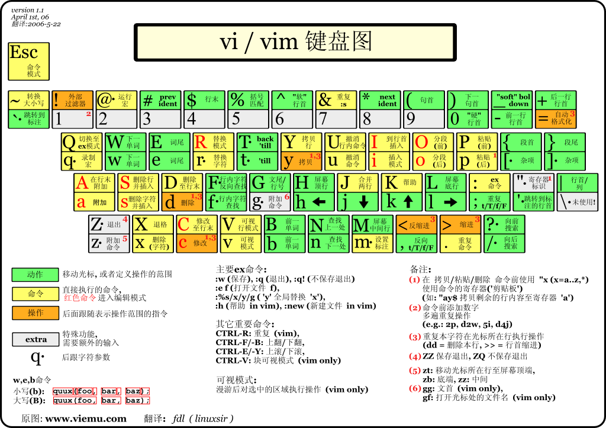

# vim的基本使用以及命令含义：

相关游戏链接：

[vim冒险之旅](http://vim-adventures.com/)

[vim蛇](http://www.vimsnake.com/)

[vim天才](http://www.vimgenius.com/)

基础搜索：

/+关键词

以下是一些 Vim 最基础的指令：

**一、模式切换**

- 插入模式（Insert Mode）

  ：

  - `i`：在光标所在位置开始插入文本。
  - `I`：在当前行的开头插入文本。
  - `a`：在光标后开始插入文本。
  - `A`：在当前行的末尾插入文本。
  - `o`：在当前行下方新开一行并进入插入模式。
  - `O`：在当前行上方新开一行并进入插入模式。

**二、移动光标**

- 基本移动

  ：

  - `h`：向左移动一个字符。
  - `j`：向下移动一行。
  - `k`：向上移动一行。
  - `l`：向右移动一个字符。

- 按词移动

  ：

  - `w`：将光标移动到下一个单词的开头。
  - `b`：将光标移动到上一个单词的开头。
  - `e`：将光标移动到当前单词的末尾。

- 按行移动

  ：

  - `0`：将光标移动到行首。
  - `$`：将光标移动到行尾。
  - `^`：将光标移动到行首的第一个非空白字符处。

**三、编辑操作**

- 删除操作

  ：

  - `x`：删除光标所在位置的字符。
  - `dd`：删除当前行。
  - `dw`：删除从光标位置开始到下一个单词开头的字符。
  - `D` 或 `d$`：删除从光标位置到行尾的字符。
  - `yy`：复制当前行。
  - `p`：将复制的内容粘贴到光标位置之后。
  - `P`：将复制的内容粘贴到光标位置之前。

**四、保存和退出**

- `:w`：保存文件。
- `:q`：正常退出 Vim，如果文件有修改会提示保存。
- `:q!`：强制退出，不保存修改。
- `:wq` 或 `:x`：保存并退出。

**五、查找和替换**

- `/[search_string]`：在文件中向下查找 `search_string`，例如 `/hello` 会查找文件中出现 `hello` 的地方，按 `n` 键可以跳转到下一个匹配项，按 `N` 键可以跳转到上一个匹配项。
- `?[search_string]`：在文件中向上查找 `search_string`。
- `:%s/old/new/g`：将文件中所有的 `old` 替换为 `new`。如果只想替换当前行的 `old` 为 `new`，可以使用 `:s/old/new/g`。

**六、撤销和重做**

- `u`：撤销上一次操作。
- `Ctrl + r`：重做被撤销的操作。

**七、文件操作**

- `:e [filename]`：打开一个新文件。
- `:new`：新建一个文件。

**八、可视模式（Visual Mode）**：

- `v`：进入字符可视模式，用于选择字符。
- `V`：进入行可视模式，用于选择行。
- `Ctrl + v`：进入块可视模式，用于选择块。