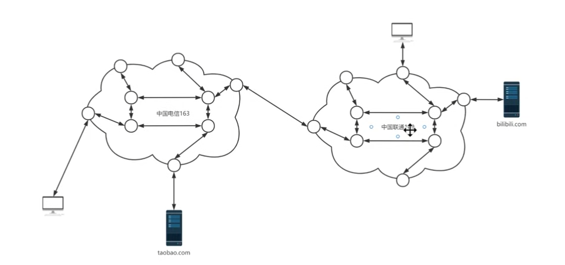
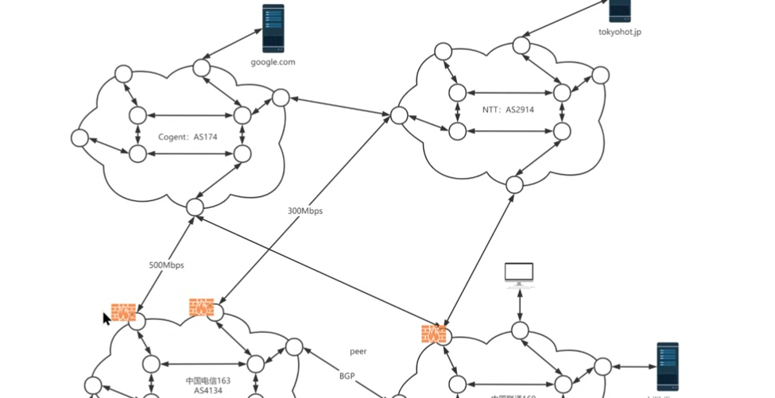

# how to build better ladder:

## 基础知识：

假设以 taobao 为例。

节点的选择，需要访问的网站与你之间的路由是否拥堵，以及路由线路是否够多。

## bgp 边境网关协议：

bgp是一种自治系统**（AS，Autonomous System）之间的路由协议**， 会给对应的网络自治系统分发编号。

ntt as2914

移动骨干网 as9808

如电信的 as4134，联通的 as4837

精品网络 as4809，联通的a网 as9929

移动的cmi as58453

这里存在 ibgp 与 ebgp 的区分。

taobao 也可以自己拉一条路由面向联通和移动，随着服务的扩大它也可以申请自己的自治系统，然后发现如果只为了淘宝访问页面业务建立的话很浪费，于是阿里云应运而生。

同时我们连接时也不一定只用光缆，我们还可以使用交换机等设备来加快交换。

所以我们可以利用 bgp 的线路来选择节点。

## gfw：

gfw的设置就会设置在国际出海口，从而对出海的数据包查看后进行拦截。

选择适合的线路，不绕路的情况下就会比较好，走cn2类似网络，带宽能承受住的情况下就能高速。

回程一般比去程更重要，去程发送的数据包大概率是请求，而返程的情况下可能是好几百 mb 的下载。

### 中转机：

中转的情况下，可以加快国内到达国际出海口的线路。

中转线路的测量可以依靠于：

https://tools.ipip.net/traceroute.php

这个估计基于 traceroute 加上 ip 地址查询的集成。比较方便，查询后就可以设计线路。

## cf的免费 cdn：

cdn 全名就是内容分发网络。cdn 服务器中具有缓存内容，如果缓存内容中含有请求的内容，那么可以直接返回到电脑。因为它们是有自己专用的光缆也就是专用的线路。

注意 cf dns 解析那个地方是否点亮，点亮的话就代表启用了 cf 本身的 cdn 分发服务。

但是由于套 cf cdn 翻墙的人太多了，导致 gfw 劣化了 cf 的 cdn。

同时套用 cdn 只对特定类型的协议有效，因为有些协议 cdn 并不接受。

另外 cdn 的使用相当于加了一层反向代理，gfw 并不知道 cdn 分发的数据到了哪里，只能知道 cdn 分发的可能是翻墙的可疑数据，于是只会墙掉 cdn，但并不会影响我们的服务器，所以被墙后，我们去掉 cdn，或者换个 cdn 又可以解决问题了。

对于 cf 而言，想要设计线路，可以去官方查询 cf 的 cdn ip 地址段，然后利用 cidr 计算器来进行计算。

https://ping.pe 这个网址也可以用来进行测试

优选 cf ip 地址项目：

https://github.com/XIU2/CloudflareSpeedTest

