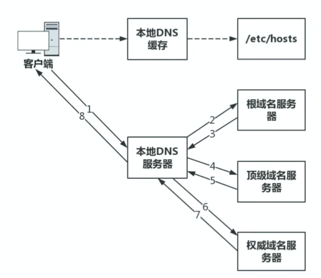
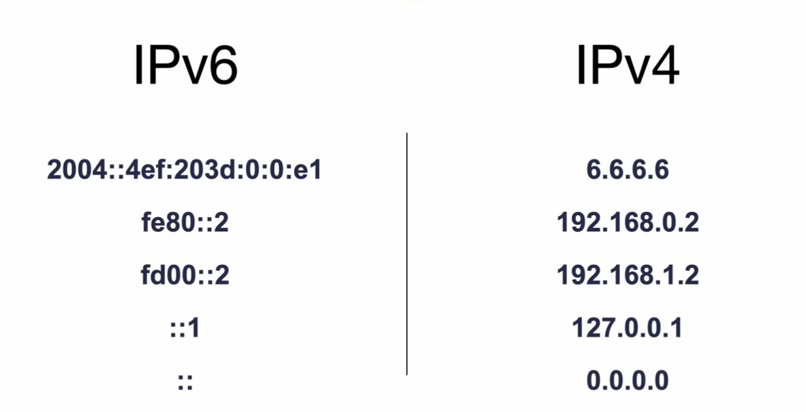

# 自建节点

## 模仿一次 dns 解析：

解析逻辑流程：



主要用到的 osi 模型前 5 层，应用层->传输层->网络层->数据链路层->物理层

模拟一次 dns 的传输：dns是位于应用层的协议，传输层这里封装的是端口，到了网络层封装的头加上了 ip 地址，数据链路层则是在前加入 mac 地址用于确定（这里主要用了 arp 协议，用 wireshark 在局域网抓包分析就能看到很多广播），然后通过物理层，由网卡通过网线将请求发送到交换机（通常在家庭网络中就是路由器）的位置，如果路由器发现请求的 ip 地址并不在局域网内，就再次将数据路由出去，一般是通过传送到公网的其它路由器。路由器经过 nat 后将内网地址转换为公网地址然后重新改写对应的目标 mac 地址，再放回数据链路层（每一次跳转路由器都会修改源 mac 和目标 mac 地址，经过传输到达 dns 服务器，由于 dns 对应应用层的协议，查询到 ip 地址后原地返回，基本是将当初传送的源和目的交换过来不断发送。（http的解析类似）

路由器的 wan 口：一般是通往公网的 ip 地址，在将数据传输前需要做一个 nat （网络地址转换，在虚拟机与宿主机的链接模式中就能找到），因为源 ip 地址在家庭局域网中为私网地址，需要上网就得先进行地址转换。

网关：？，在家里一般是路由器（路由器还充当dns解析器），在校园内一般是交换机？（这里得改天研究下，我也不太确定），我也很好奇校园网内到底是怎么样一个配置。

子网掩码（Subnet Mask）是用于划分 IP 地址网络范围的一个 32 位数（IPv4），它用于确定某个 IP 地址属于哪个子网。

## GFW:

1.五层应用，可以解析到应用层的协议，大概率是篡改数据包中 ip 地址的访问从而到达不了自己想要的数据，**也就是dns劫持（污染）**。

应对方法：不发起 dns 请求，可以考虑更改 dns 缓存，比如 host 文件，这是早期绕过 gfw 的方法

2.但防火墙可以解析到应用层，即使跳过了dns解析环节，国外被禁ip发送到了防火墙后，防火墙发现这个对应 ip 地址是在自己的黑名单上，于是伪造数据包，**这就是 tcp 重置攻击（因为http协议的建立本就需要建立对话）**

3.即使建立了连接，侥幸发送时，由于此时发送的内容数据包含的是对应域名的内容，gfw 的 ip 黑名单绕过了，但是域名黑名单中仍然有，所以依然打回去了。

4.利用 http 和 socks 代理时，由于 gfw 解析到应用层，如果在应用层的请求被发现是访问被禁 ip 地址和网站时（也就是能看到我们的数据流量），则有可能自己的 vps 代理服务器也会被加入到黑名单中。

5.传统的 vpn 服务 ipssec 和 openvpn 都是加密了，但是流量中很明显表明了是 vpn 连接，于是代理服务器对应的 ip 地址也会被列入风险列表中，从而可能引起封禁。

以上便是 gfw 可能的封禁原理。

## ipv4与ipv6：

由于 ipv4 的地址数显然不够，所以家庭局域网的 ip 基本都是私有 ip ，比如典型的 192.168.1.1 经常是路由器的地址。然后要上网的话就会由内网的地址将数据包先发送给路由器，路由器经过 NAT 地址转换，就可以转换成公网 ip 发送到公网上请求，公网上的数据再经过路由器回到请求端。这也是为什么本地部署的项目无法在外部访问。**如果想要访问的话，可以通过端口转发、udp打洞，dmz等nat穿透行为来访问。**不过这是在路由器具有公网 ip 的情况下，大概率路由器的 ip 也是**pppoe**拨号，位于运营商旗下的私有 ip 

如果每台都能拥有 ipv6 的话，那么就不需要经过路由器的 NAT 地址转换就可以直接访问到公网了。

ipv6 以16进制划分，可分发数量高达2^128，解决了 ipv4 地址不够用的问题。真正实现万物互联。



ipv4 与 ipv6 的对应地址表示。

## 代理软件的 tun 模式：

tun 本质上是创建了一张虚拟网卡，在网络层就截取了流量，根据路由表（可使用 route print 查看）的规则来进行分流，从而实现所有 app 均走代理的目的。而 tap 模式更进一步，甚至可以接管 mac 地址，但 mac 地址对于我们的上网并无太大影响，所以基本推荐 tun 代理模式。但这里还算不上真正的vpn，因为我们使用的 ss 等协议是无法处理网络层的，最直观的层面就是网络层的 icmp 协议，当我们以 tun 模式 ping 谷歌时，就会返回一个假的延迟。

# 最基础的原理知识：

以下均为 chatgpt 作的解释：

# **什么是端口？**

**端口（Port）** 是计算机 **操作系统** 中用于区分不同网络服务或应用程序的 **逻辑编号**。端口的作用是帮助计算机在同一个 IP 地址上 **同时运行多个网络应用**，每个应用通过不同的端口进行数据传输。

💡 **简单比喻**：

- **IP 地址** 就像是一栋大楼的 **地址**，用于定位计算机（主机）。
- **端口** 就像是大楼里的 **房间号**，用于区分不同的服务或程序。
- 例如：
  - 访问 `http://example.com:80`，你的请求会到达 **80 号端口**，服务器上的 Web 服务器（如 Nginx 或 Apache）会处理这个请求。
  - 访问 `https://example.com:443`，你的请求会到达 **443 号端口**，并使用 HTTPS 进行加密通信。

------

## **1. 端口的分类**

端口号的范围是 **0 - 65535**，可以分为三类：

| 端口范围          | 分类                                       | 作用                                                    | 例子                                                 |
| ----------------- | ------------------------------------------ | ------------------------------------------------------- | ---------------------------------------------------- |
| **0 - 1023**      | **知名端口（Well-Known Ports）**           | 被官方机构 **IANA**（互联网数字分配机构）分配给常见服务 | 80（HTTP）、443（HTTPS）、22（SSH）、25（SMTP 邮件） |
| **1024 - 49151**  | **注册端口（Registered Ports）**           | 由软件开发者申请使用，但不是强制规定                    | 3306（MySQL）、5432（PostgreSQL）、1883（MQTT）      |
| **49152 - 65535** | **动态/私有端口（Dynamic/Private Ports）** | 操作系统 **临时分配**，用于客户端向服务器发起连接       | 访问网页时，浏览器可能会使用 50000+ 端口             |

------

## **2. 端口的工作原理**

当你的计算机访问一个网站或服务器时，数据包必须有：

1. **目标 IP 地址**（指向服务器）
2. **目标端口号**（指向具体的服务）

### **示例：访问网页**

你在浏览器输入 `https://example.com`：

1. 你的计算机会向 `example.com` 解析 **IP 地址**（比如 `192.168.1.100`）。

2. 浏览器会向 

   443 号端口

    发送 HTTPS 请求：

   ```
   目标地址: 192.168.1.100
   目标端口: 443（HTTPS）
   ```

1. 服务器的 Web 服务器（如 Nginx）监听 **443 端口**，处理你的请求并返回网页。

------

## **3. TCP 和 UDP 端口**

端口可以分为 **TCP 端口** 和 **UDP 端口**，两者的区别如下：

| **协议**                  | **特点**                           | **应用场景**                       | **示例端口**                                       |
| ------------------------- | ---------------------------------- | ---------------------------------- | -------------------------------------------------- |
| **TCP（传输控制协议）**   | **可靠**（有连接、确认、重传机制） | 需要确保数据不丢失、顺序正确的场景 | 80（HTTP）、443（HTTPS）、22（SSH）、3306（MySQL） |
| **UDP（用户数据报协议）** | **不可靠**（无连接、无确认、快）   | 实时通信、视频、游戏等             | 53（DNS）、161（SNMP）、123（NTP）、500（VPN）     |

💡 **比喻**：

- **TCP** 像是 **寄快递**，有完整的确认流程，确保包裹完整无损地送达。
- **UDP** 像是 **寄明信片**，快速但不保证一定送达。

------

## **4. 常见端口号**

一些常见的端口和它们的作用：

| 端口号 | 协议 | 说明                  |
| ------ | ---- | --------------------- |
| 20、21 | TCP  | FTP 文件传输协议      |
| 22     | TCP  | SSH 远程登录          |
| 25     | TCP  | SMTP 发送邮件         |
| 53     | UDP  | DNS 域名解析          |
| 80     | TCP  | HTTP（网页浏览）      |
| 443    | TCP  | HTTPS（加密网页浏览） |
| 3306   | TCP  | MySQL 数据库          |
| 6379   | TCP  | Redis 缓存数据库      |
| 8080   | TCP  | 常用的 HTTP 备用端口  |
| 25565  | TCP  | Minecraft 游戏服务器  |

---


# 如何理解子网掩码

## 1. **子网掩码的作用**

子网掩码的主要作用是 **划分网络部分（Network）和主机部分（Host）**，用于确定两台设备是否在同一子网内。

例如：

- **IP 地址**：192.168.1.10
- **子网掩码**：255.255.255.0

子网掩码 `255.255.255.0` 说明：

- **网络部分（Network）**：192.168.1
- **主机部分（Host）**：10
  这意味着 **192.168.1.1 到 192.168.1.254** 都属于同一个子网。

------

## 2. **子网掩码的表示方式**

子网掩码可以用两种方式表示：

1. **点分十进制格式**（常见的四部分表示法）

   - 255.255.255.0
   - 255.255.0.0
   - 255.0.0.0

2. **CIDR（无类域间路由）格式**

   - `/24`（等价于 255.255.255.0）
   - `/16`（等价于 255.255.0.0）
   - `/8`（等价于 255.0.0.0）

   `/24` 代表前 **24 位** 是网络位，后 **8 位** 是主机位。

------

## 3. **子网掩码如何计算网络范围**

子网掩码的 **网络位** 和 **主机位** 通过按位 **与（AND）** 运算来确定。

例如： **IP 地址**：192.168.1.10
**子网掩码**：255.255.255.0
转换为二进制：

```
IP 地址:     11000000.10101000.00000001.00001010
子网掩码:   11111111.11111111.11111111.00000000
----------------------------------------------
网络部分:   11000000.10101000.00000001.00000000 （即 192.168.1.0）
```

所以：

- **网络地址（Network Address）**：192.168.1.0
- **广播地址（Broadcast Address）**：192.168.1.255
- **可用主机范围**：192.168.1.1 ~ 192.168.1.254

------

## 4. **常见子网掩码及子网大小**

| 子网掩码        | CIDR | 可用 IP 数量（减去网络地址和广播地址） |
| --------------- | ---- | -------------------------------------- |
| 255.0.0.0       | /8   | 16,777,214 个（A 类网络）              |
| 255.255.0.0     | /16  | 65,534 个（B 类网络）                  |
| 255.255.255.0   | /24  | 254 个（C 类网络）                     |
| 255.255.255.128 | /25  | 126 个                                 |
| 255.255.255.192 | /26  | 62 个                                  |
| 255.255.255.224 | /27  | 30 个                                  |
| 255.255.255.240 | /28  | 14 个                                  |

------

## 5. **如何判断两个 IP 是否在同一子网**

例如：

- **设备 A**：IP = 192.168.1.10，子网掩码 = 255.255.255.0
- **设备 B**：IP = 192.168.1.200，子网掩码 = 255.255.255.0

计算两者的 **网络地址**：

- **A 的网络地址** = `192.168.1.0`
- **B 的网络地址** = `192.168.1.0`

两者相同，说明 **在同一子网**，可以直接通信。

如果 **设备 B** 的 IP 改为 `192.168.2.200`：

- A 的网络地址 = `192.168.1.0`
- B 的网络地址 = `192.168.2.0`

网络地址不同，说明 **不在同一子网**，需要路由器转发数据。

------

## 6. **总结**

- 子网掩码用来划分 **网络部分** 和 **主机部分**。

- 通过 **按位与运算** 计算网络地址，判断是否在同一子网。

- **CIDR 表示法**（如 `/24`）更简洁，`/24` 代表前 24 位是网络位。

- **常见的子网掩码** 主要用于不同规模的网络划分。

  ---

  

# 常见的 http 和 socks 代理：

## **1. HTTP 代理**

### **📌 概念**

**HTTP 代理** 主要用于处理 **HTTP（网页）和 HTTPS（加密网页）请求**，适用于 **网页浏览、爬虫、API 访问等**。

### **📜 工作原理**

- **客户端（浏览器） -> HTTP 代理 -> 目标网站**
- 代理服务器接收 HTTP/HTTPS 请求，代表客户端向目标网站发起请求，并返回响应数据。

### **🔗 常见的 HTTP 代理类型**

1. **透明代理（Transparent Proxy）**：
   - 不修改用户请求，目标网站仍能看到用户真实 IP。
   - **用途**：企业、学校、ISP（用于流量监控）。
2. **匿名代理（Anonymous Proxy）**：
   - 隐藏用户 IP，目标网站看到的是代理服务器的 IP。
   - **用途**：防止网站追踪、隐藏真实身份。
3. **高匿名代理（Elite Proxy）**：
   - 目标网站无法检测出代理的存在，表现得像真实用户。
   - **用途**：爬虫、数据采集、隐私保护。

### **🌍 应用场景**

✅ **网页访问**（如：公司屏蔽 YouTube，可通过 HTTP 代理访问）
        ✅ **爬虫**（爬取网页数据，避免被封 IP）
        ✅ **加速访问**（CDN 代理缓存，提高访问速度）
        ✅ **广告屏蔽**（一些 HTTP 代理可以拦截广告）

## **2. SOCKS 代理**

### **📌 概念**

**SOCKS 代理** 是一个 **低级别的通用代理**，它可以代理 **任何类型的网络流量**，不仅限于 HTTP/HTTPS，还包括 **邮件、游戏、P2P、远程桌面等**。

### **📜 工作原理**

- **客户端（任何应用） -> SOCKS 代理 -> 目标服务器**
- SOCKS 代理**不解析 HTTP 数据**，它只是简单地**转发 TCP 或 UDP 数据包**，就像是一条 **数据通道**。

### **🆚 SOCKS5 vs SOCKS4**

| 版本       | 支持 TCP | 支持 UDP | 支持身份验证                 | 支持 IPv6 |
| ---------- | -------- | -------- | ---------------------------- | --------- |
| **SOCKS4** | ✅ 是     | ❌ 否     | ❌ 否                         | ❌ 否      |
| **SOCKS5** | ✅ 是     | ✅ 是     | ✅ 是（用户名/密码或 GSSAPI） | ✅ 是      |

SOCKS5 更加**灵活、安全、支持 UDP**，因此大多数情况下推荐使用 SOCKS5。

### **🌍 应用场景**

✅ **匿名上网**（隐藏真实 IP，可用于 BT 下载、游戏、远程访问）
        ✅ **绕过防火墙**（支持 UDP，适用于 VoIP、流媒体等应用）
        ✅ **远程桌面**（SOCKS 代理可穿透内网访问远程电脑）
        ✅ **P2P 下载**（如 BitTorrent，支持 UDP 传输）
        ✅ **邮件客户端**（SMTP、POP3 代理，提高隐私性）

## **3. SOCKS 代理 vs HTTP 代理：对比总结**

| **对比项**       | **HTTP 代理**                        | **SOCKS 代理**                                             |
| ---------------- | ------------------------------------ | ---------------------------------------------------------- |
| **工作方式**     | 解析并转发 HTTP/HTTPS 请求           | 纯数据转发，不解析数据                                     |
| **支持的协议**   | 仅 HTTP、HTTPS                       | **所有协议**（TCP/UDP，包括 HTTP、FTP、SMTP、P2P、游戏等） |
| **是否匿名**     | 取决于代理类型（透明、匿名、高匿名） | 默认匿名（不修改数据内容）                                 |
| **是否支持 UDP** | ❌ 不支持                             | ✅ 支持（SOCKS5）                                           |
| **适用于**       | 浏览器、爬虫、API 调用               | 游戏、P2P、远程桌面、流媒体                                |
| **安全性**       | HTTP 代理可被劫持（除非 HTTPS）      | SOCKS5 更安全，支持身份验证                                |
| **速度**         | 取决于代理服务器性能                 | 一般比 HTTP 代理更快                                       |

## 关于pppoe拨号：

### **PPPoE 拨号（PPP over Ethernet）是什么？**

**PPPoE（Point-to-Point Protocol over Ethernet，基于以太网的点对点协议）\**是一种网络协议，常用于\**宽带拨号上网**。它本质上是**在以太网（Ethernet）上封装 PPP 协议**，让用户通过拨号的方式连接到 ISP（互联网服务提供商）。

------

## **PPPoE 的作用**

1. **宽带认证拨号**
   - ISP 通过 PPPoE 让用户在接入互联网前必须输入**账号和密码**进行身份验证。
   - 例如：家用宽带（电信、联通、移动）通常需要使用 PPPoE 进行拨号连接。
2. **IP 地址分配**
   - ISP 通过 PPPoE 服务器（BRAS）给用户动态分配公网 IP 或私网 IP。
3. **流量计费**
   - ISP 可以通过 PPPoE 统计用户流量，用于**按流量计费**（例如部分移动宽带）。
4. **支持多个用户**
   - 通过 PPPoE，可以让多个用户在同一物理网络下拥有不同的认证信息，各自拨号上网。

------

## **PPPoE 拨号的工作流程**

PPPoE 拨号分为**两个阶段**：

### **1. 发现阶段（Discovery Stage）**

设备（客户端）需要找到 ISP 的 PPPoE 服务器，并建立连接：

- PADI（PPPoE Active Discovery Initiation）
  - 客户端（如你的电脑、光猫、路由器）广播**PADI 包**，寻找 PPPoE 服务器。
- PADO（PPPoE Active Discovery Offer）
  - ISP 服务器收到 PADI 后，回复**PADO 包**，告诉客户端 "我可以提供拨号服务"。
- PADR（PPPoE Active Discovery Request）
  - 客户端向服务器发送**PADR 包**，请求建立会话。
- PADS（PPPoE Active Discovery Session-confirmation）
  - 服务器确认并分配一个**Session ID**，建立连接。

### **2. 认证 & 传输阶段（Session Stage）**

连接建立后，客户端需要进行身份认证：

- **LCP（链路控制协议，Link Control Protocol）**：初始化连接，协商 MTU、MRU 等参数。

- PAP / CHAP（认证协议）

  ：

  - 客户端发送**账号 + 密码**（PAP 明文 or CHAP 加密）。
  - 服务器验证用户身份，成功后分配 IP 地址（可能是**动态公网 IP**或**私网 IP**）。

- **网络数据传输**：认证通过后，设备可以通过 PPPoE 进行数据通信。

------

## **PPPoE 和 DHCP 的区别**

| **对比项**   | **PPPoE**           | **DHCP**               |
| ------------ | ------------------- | ---------------------- |
| **认证方式** | 需要账号和密码拨号  | 连接后自动获取 IP      |
| **适用场景** | 宽带拨号、ISP 认证  | 局域网、家庭网络       |
| **IP 分配**  | 由 ISP 服务器分配   | 由本地 DHCP 服务器分配 |
| **数据封装** | 使用 PPP + Ethernet | 直接基于 IP            |

- **家庭宽带**通常使用 **PPPoE 拨号**（需要账号密码）。
- **公司 / 学校局域网**一般使用 **DHCP** 自动获取 IP（无需拨号）。

------

## **PPPoE 拨号如何配置？**

如果你家里的网络使用 PPPoE 拨号，通常可以在**光猫或路由器**上进行配置。

### **方法 1：在路由器上配置 PPPoE**

1. **进入路由器管理页面**（通常是 `192.168.1.1`）。
2. **选择“WAN 连接”方式**，找到 **PPPoE**。
3. **输入 ISP 提供的账号和密码**（通常在宽带开户时提供）。
4. **保存并连接**，成功后，路由器会自动拨号并分配 IP 地址。

### **方法 2：在电脑上手动拨号**

适用于**没有路由器**的情况：

1. 打开 **Windows 网络设置**，选择 **新建拨号连接**。
2. 输入宽带账号和密码，点击 **连接**。
3. 连接成功后，电脑可以直接访问互联网。

------

## **PPPoE 拨号的优缺点**

### **✅ 优点**

- **支持用户认证**（防止未经授权的设备接入）。
- **动态公网 IP 分配**（部分运营商可能会分配公网 IP）。
- **支持流量计费和 QoS 管理**（运营商可以管理带宽）。

### **❌ 缺点**

- **需要手动拨号**（需要账号密码，不能即插即用）。
- **PPPoE 头部开销较大**（每个数据包多出 8~12 字节）。
- **有 MTU 限制**（通常为 1492，可能导致某些网站加载异常）。

------

## **PPPoE 拨号与翻墙的关系**

GFW（防火长城）对国内宽带用户的流量进行**监控和封锁**，PPPoE 拨号可能会影响翻墙方式：

1. **公网 IP vs. 私网 IP**
   - **如果 ISP 分配公网 IP**，可以直接搭建 VPN / 代理服务器（如 Shadowsocks）。
   - **如果 ISP 分配私网 IP**，你无法直接被外网访问，需要**内网穿透（如 FRP、WireGuard）**。
2. **宽带劫持**
   - 部分 ISP 在 PPPoE 服务器端插入劫持代码，可能会劫持 HTTP 流量（比如插广告）。
   - 解决方法：使用 **HTTPS / DoH / DoT** 加密 DNS 请求。
3. **翻墙稳定性**
   - PPPoE 连接可能受**ISP QoS 限制**，某些翻墙流量（如 VPN、Shadowsocks）可能会被限速或封锁。
   - 解决方案：
     - 使用 TCP BBR 加速。
     - 选择 **Trojan / V2Ray / XTLS** 等更隐蔽的协议。

------

## 关于tun（tunnel模式的详细介绍）

### **TUN 模式及 Tunnel（隧道）的理解**

TUN（**network TUNnel**）模式是一种**虚拟网络接口**，主要用于**三层（IP 层）数据传输**，通常用于 VPN、代理等网络应用。

------

## **1. 为什么叫 Tunnel（隧道）？**

“TUN” 取自 **“TUNnel”（隧道）**，它的名字来源于**网络隧道（Tunneling）技术**，即**在一种网络协议内封装另一种协议，实现数据传输**。

想象一下：

- **普通网络传输**：数据在设备之间直接传输，像公路上的普通车辆。
- **隧道传输（Tunneling）**：数据被“包装”起来，通过一条特殊的“通道”传输，就像汽车被装进隧道运送，外界无法看到汽车的具体内容。

TUN 设备的作用就是**创建这样的隧道，使数据能够以特殊方式传输**，比如：

- **VPN（虚拟专用网络）** 通过 TUN 设备把本地 IP 数据封装到远程服务器，绕过网络限制。
- **代理软件（如 Shadowsocks、V2Ray）** 用 TUN 让本地应用的数据流过远程代理服务器。

------

## **2. TUN 模式是什么？**

**TUN（网络隧道模式）** 是一种**三层（IP 层）虚拟网络设备**，它允许用户空间的程序**接收和发送 IP 数据包**，就像是一个真正的网络接口。

### **TUN 的特点**

- **工作在三层（IP 层）**，处理 **IP 数据包**（TCP/UDP）。
- **用户态与内核态之间的桥梁**，数据可以被应用程序直接处理。
- **用于 VPN、代理、虚拟网络**，如 OpenVPN、WireGuard、V2Ray TUN 模式等。

### **TUN 的工作流程**

1. **操作系统创建 TUN 虚拟网络接口**（如 `tun0`）。
2. **应用程序（如 VPN 客户端）打开 TUN 设备**，读取和写入数据。
3. **数据从 TUN 接口进入，应用程序可以修改并发送到实际网络**。

### **TUN 应用场景**

- **VPN（如 OpenVPN、WireGuard）**：用于封装 IP 数据包，实现远程访问。
- **科学上网（如 Clash TUN、V2Ray TUN）**：让本地程序的数据走代理。
- **虚拟网络**：如 Kubernetes 内部的容器网络。

------

## **3. TUN vs. TAP**

TUN（网络隧道）和 TAP（网络桥接）是两种不同的虚拟网络设备模式。

| **对比项**   | **TUN（网络隧道）**                       | **TAP（网络桥接）**               |
| ------------ | ----------------------------------------- | --------------------------------- |
| **工作层**   | 三层（IP 层）                             | 二层（数据链路层，以太网帧）      |
| **处理数据** | 处理 IP 数据包                            | 处理以太网帧                      |
| **用途**     | VPN、代理、虚拟路由                       | 局域网模拟、虚拟机网络            |
| **应用**     | OpenVPN（TUN 模式）、WireGuard、V2Ray TUN | OpenVPN（TAP 模式）、QEMU、Docker |

### **如何选择？**

- **TUN** 适用于需要 **处理 IP 层流量** 的场景，如 VPN、代理。
- **TAP** 适用于需要 **模拟完整以太网连接** 的场景，如虚拟机、桥接网络。

------

## **4. TUN 在翻墙中的应用**

许多代理软件（如 **V2Ray、Clash、Tun2Socks**）利用 TUN 模式，让系统或特定应用的网络流量**自动走代理**，绕过 GFW。

### **如何实现？**

1. **创建 TUN 设备（如 `tun0`）**
2. **把流量路由到 TUN 设备**
3. **代理程序从 TUN 设备读取 IP 数据包**
4. **通过代理（如 Shadowsocks、V2Ray）发送到远程服务器**
5. **远程服务器解封装，访问真正的网站**

这样，所有网络流量都会经过代理，无需手动设置 SOCKS 代理，**可以代理所有应用，包括不支持代理的软件**（如游戏、系统更新）。

------
