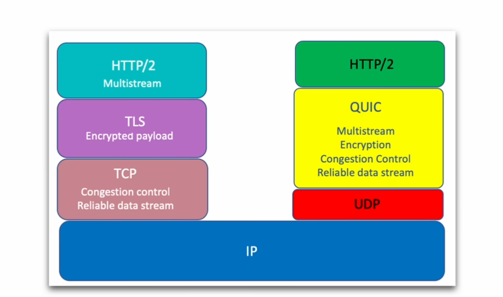
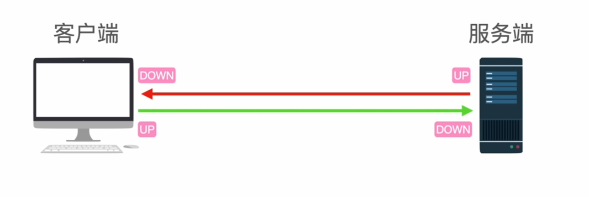

#  hysteria2:

关于歇斯底里我一直感到很困惑。

因为我梯子里的 hysteria2 协议的都用不了...

现在想来大概率是校园网不支持 quic 协议（这点有待考证，改天抓包分析下，虽然我还不确定能否基于这里分析）

## 基本介绍：

hysteria2 的加速是基于抢！

官方文档：https://v2.hysteria.network/

即利用了 quic 协议，而 quic 协议是基于 udp。

quic协议在udp之上实现了可靠传输和拥塞控制

而歇斯底里正是基于该协议，它并没有遵循 bbr 和 cubic 等拥塞分配的算法，在线路拥堵时依旧保持原速发送，从而增加了自己的速率。
         所以在丢包率不高的线路下，歇斯底里的加速并不高，只有垃圾线路才能得到明显优化。

## 带宽的传输与下载：

测校园网的速：

https://speedtest.cn

测出来大致是下载速度 126mb 左右

上传速度则在 220mb 左右。还算比较快

歇斯底里可以通过在配置文件中更改服务端与客户端对应的下载上传限制来增强使用者的体验，算是一个缺德协议...