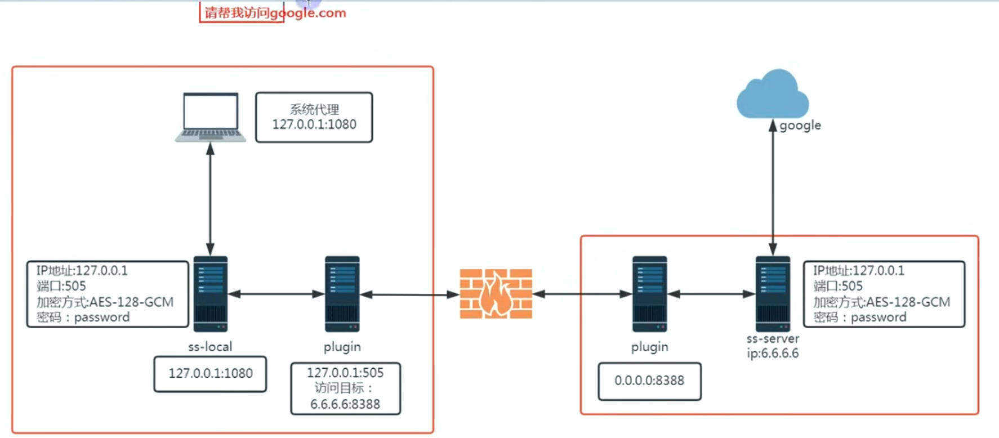
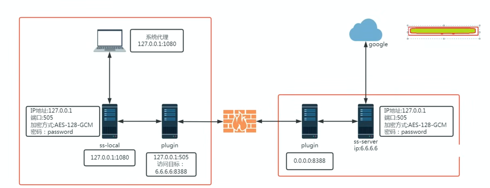

# ss——shadowsocks：最初的翻墙协议

ss 的基本思路是对数据包进行加密，让 gfw 解析不出来应用层的目的，但是这里 gfw 可以通过重发的思路来检验对应的可疑服务器是否存在代理服务。

例如如果我想访问谷歌，ss 对称加密对应协议后将数据包发到我们的代理服务器上，由于 gfw 看不到我们的数据包内容予以放行，但是它会感到可疑，于是会重发一个数据包到我们对应的代理服务器上，虽然由于没有密钥并不会得到正确内容，但是对应代理服务器很有可能返回一个数据包，从而告诉 gfw 我们的代理服务器上运行了一个 ss 服务，然后予以封禁。

## plugin 的优化：

对发送的数据包进行了流量伪装，将对应的数据包加上了 http 头，让 gfw 误认为我们在访问一个网站，从而不会重发数据包，然后对应服务端的 plugin 去掉对应的头，将原始信息发给服务端也就是我们的代理服务器，然后由代理服务器访问返回后再加密回去。

但这种是最简单的插件，更高级一点的插件会将将其进行 tls 加密从而伪装更好。
