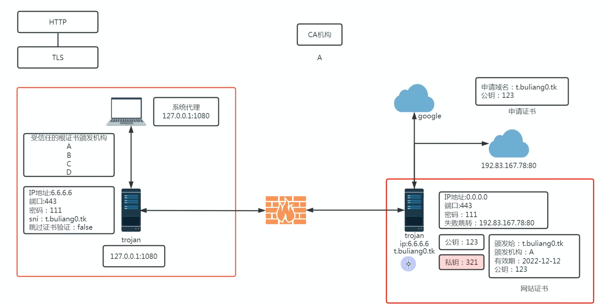

# trojan：特洛伊木马

trojan 本身就是将数据包伪装成 https 的加密，因为对于 ss 来说，纵使我们添加了伪装的 http 头协议，但是由于 http 是明文传输的，所以对于 http 来说，如果 gfw 进行深度探测的话依旧是可以显示是在干嘛的。

## 对于 https 的原理理解：

https = http + tls

**tls 的握手，告诉网站我要用 https 访问你，网站将其对应的证书返还给请求者，浏览器会检查证书是否合理，然后协商进行对称加密**

非对称加密算法的公钥私钥：不一致，必须得对应解密才行

私钥相当于是自留地，公钥是大家都能看看

恰好上个周看到的文章发挥了作用:

[为什么要给网站颁发证书](https://www.kawabangga.com/posts/5330)

certmgr.msc 可以查看我们的系统内有哪些证书

## trojan原理：

对应的 trojan 中文网。

trojan 本质就是模仿 https 进行加密，所以需要先具有一个域名然后向 ca 机构申请证书，通过证书来加密，于是请求时，客户端发送请求，先进行   tls 加密，于是将证书发到客户端，加密后只会显示出域名，于是 gfw 判断不出是加密的什么，只能辨认出这是一个类似 https 请求的流量，并且不在它的黑名单上，予以放行

[trojan中文网](https://www.linuxtrojan.com/server/)，github上也有 trojan 的库。打算拿来研习一下。

如果没有对应的密码以及没有以 trojan 对应的方式连接，那么服务器会返回 192.83.167.78:80对应服务器的假地址，通常会呈现出假网站的特性

## 自签证书的实现：

我们也可以自己来充当 ca 机构，自己给自己颁发证书，然后将证书加入到受信任的证书机构，或者直接跳过证书验证环节

trojan-go 官方文档：[trojan-go](https://p4gefau1t.github.io/trojan-go/)

github 地址: [trojan-go](https://github.com/p4gefau1t/trojan-go)

## sni是什么：

理解了 sni 才能更好理解 trojan 的原理。

以下为gpt的解释：

在 HTTPS 连接中，TLS 证书用于加密通信，但在 TLS 1.2 及之前的版本中，**服务器必须在加密会话建立前就知道使用哪个证书**。问题是：

- 在 **一个 IP 地址上托管多个 HTTPS 网站（如共享主机）** 时，服务器无法在 TLS 握手阶段区分访问的是哪个网站，导致证书匹配失败。

**SNI 通过在 TLS 握手时传递目标域名，解决了这个问题**，使得一个服务器可以**使用不同的 TLS 证书为多个网站提供 HTTPS 服务**。

------

## **SNI 的工作原理**

SNI 主要出现在 **TLS Client Hello** 阶段：

1. 客户端（浏览器）发送 TLS Client Hello

   ：

   - 包含支持的 TLS 版本、加密算法等信息。
   - 额外携带 **SNI 扩展字段**，指定要访问的域名（如 `example.com`）。

2. 服务器收到请求，检查 SNI 字段

   ：

   - 根据 SNI 指定的域名选择**正确的 SSL/TLS 证书**。

3. 服务器返回 TLS Server Hello

   ：

   - 使用匹配的证书继续握手，建立安全的 HTTPS 连接。

**如果服务器不支持 SNI**，可能会返回默认证书或直接拒绝连接。

------

## **SNI 的应用**

1. **共享 IP 的 HTTPS 网站**
   - 让多个 HTTPS 站点共用**同一个 IP 地址**（虚拟主机）。
   - 例如：`example.com` 和 `test.com` 在同一服务器上，但各自有不同的 SSL 证书。
2. **CDN（内容分发网络）**
   - CDN 需要托管多个域名，SNI 允许 CDN **动态选择正确的 SSL 证书**。
3. **防火长城（GFW）利用 SNI 进行审查**
   - GFW 监控 SNI 字段来**识别和封锁特定网站**，导致某些翻墙方式（如 TLS 1.2）容易被检测和封锁。

------

## **SNI 与翻墙**

- **SNI 明文传输（TLS 1.2 及以下）**
  - 在 TLS 1.2 及以前的版本，SNI **以明文方式** 发送，因此**防火长城（GFW）可以检测和封锁**某些网站（如 Google、YouTube）。
- **ESNI（加密 SNI，TLS 1.3 过渡方案）**
  - ESNI（Encrypted SNI）尝试加密 SNI 字段，使防火墙无法识别，但被 GFW 彻底封锁。
- **ECH（TLS 1.3 中的 Encrypted Client Hello）**
  - ECH 取代 ESNI，**加密整个 Client Hello**，让 GFW 无法检测 SNI，但目前部署仍不广泛。

### **如何绕过 SNI 审查？**

1. **使用 TLS 1.3 + ECH**（但国内大部分网络不支持）。
2. **伪装 SNI**（如 Cloudflare CDN 伪装）。
3. **使用 IP 直连**（不依赖 SNI，但不适用于多域名托管）。
4. **基于 WebSockets/TLS 隧道（如 Trojan、V2Ray）**，避免 SNI 暴露真实域名。

------

## **总结**

- **SNI 作用**：允许多个 HTTPS 站点共享同一 IP，指定正确的 SSL 证书。

- **SNI 机制**：在 TLS 握手（Client Hello）中发送目标域名，服务器据此选择证书。

- **SNI 安全问题**：TLS 1.2 及以下，SNI 以**明文传输**，可能被**防火墙监控和封锁**。

- 解决方案

  ：

  - **TLS 1.3 + ECH**（最优解，但兼容性问题）。
  - **使用 CDN 代理**（如 Cloudflare）。
  - **使用 WebSockets/TLS 隧道（如 V2Ray、Trojan）**。