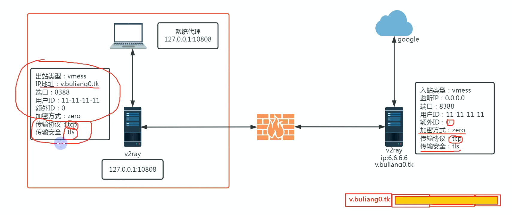
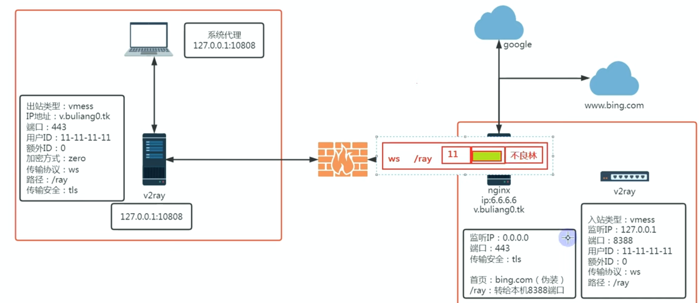

# vmess——据说是最稳定的翻墙方式？

vmess 使用 id 和所谓的额外 id 方式来进行加密

利用时间戳再加上用户额外 id 进行 hash 加密，一般是 md5 的hash 加密。

由于 hash 的不可逆性，hash 加密后其实一开始不能解读的，所以这里取的时间戳本质上是一个 -x~+x 的取值，也就是会与正确的系统时间戳发生一个偏移，于是到了代理服务器那边，vmess 协议会在这个时间差内取遍所有的时间戳进行 hash 加密来对应  

## 承载与伪装：

承载可以理解为选用了什么协议来传输你的数据包。我们可以通过对各种协议的优化来达到目的。

vmess + tcp + tls 这是 vmess 的升级版，更不易于检测到 ，同时在这里可以下一个定论，传输层就是 udp 和 tcp，其它的扩展协议，例如 ws(websocket)，kcp 等都是基于这两大协议进行封装的

伪装则是比如加一点 http 头的数据，加到里面去从而让 gfw 不方便辨认。

但由于 vmess 没有错误跳转机制，所以直接访问 https 的话会返回错误，于是我们需要模仿 trojan ，添加一个 web 服务器

ws 协议在这里的作用是改变了访问路径，添加了 /ray 后的话访问路径就会给服务器信息，这是一个 https 请求，从而 web 服务器（caddy，nginx）这类型就会对其进行处理，使其访问到正常的 web 界面，达到伪装效果，同理，trojan 也可以以这种方式来进行伪装。

