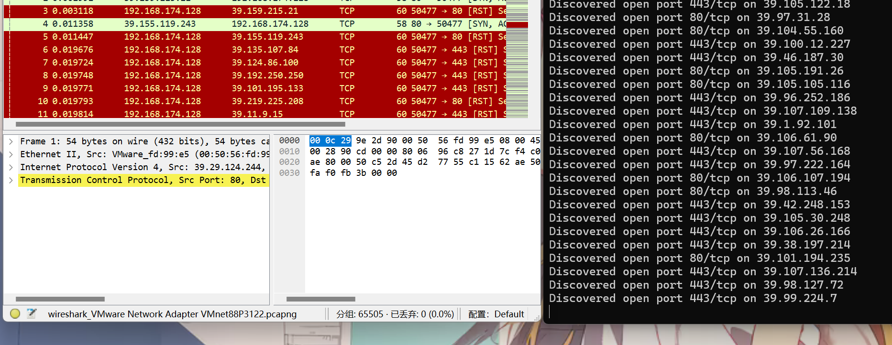
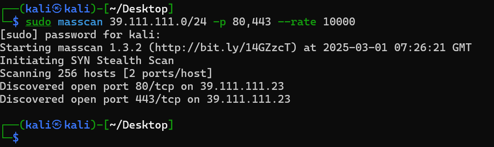
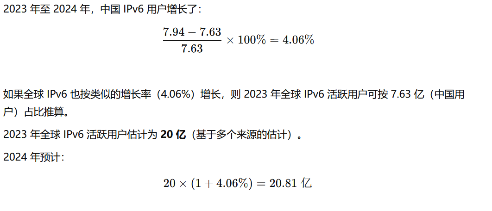

# 计算机网络实验一

实验内容：探测全世界当前活跃的 ipv4 与 ipv6，尽可能找到多的关键节点，并且说明为什么该节点很重要。

> 实验格式
>
> 1、 Analysis
>
> 2、Code (key part)  and explanation
>             3、Results
>
> 4、References

## 1、分析：

拿到实验的第一个想法是去找相对较活跃网段扫描估计，然后以类似取样计算来估计。但是经过思考后，发现 ipv6 地址实在太大了，相较于 ipv4 基本已经饱和，ipv6 扫一圈大概率也没几个活的...所以对 ipv6 改变了策略，选择查询网上公开的资料来统计估算，毕竟本身普及率也不算太高，也就工信部发了文件让中国境内 ipv6 普及率很高。

## 2、实践以及探索：

### ipv4：

我的实验环境是 Kali GNU/Linux 2024.4 ，里面自带的一些工具比较方便。

最终在 zmap 和 masscan 中选择了 masscan，并且由于众所周知的原因，扫描的网段主要敲定在亚洲区域（不然国外的丢包率实在太高了，本来误差就够大了，这样扫下去估计离结果就更远了...)

本着就近原则，选择了扫描电信、移动的网段：

```bash
masscan 39.0.0.0/8 -p 80,443 --rate 10000  # 中国电信、中国移动
```

以此作为估计，由于 ipv4 地址本身将近枯竭，所以按照理论上来说，每一个活跃的公网网段都应接近满员。统计扫描的总数（虽然很有可能很多扫描会被 waf 侦察到啥也扫描不到，但也只能死🐎当活🐎医了，误差也不差这一点了。），并且为了加快效率，只统计了大概率提供 web 服务的 80 和 443 端口，显然，漏掉了很多内容， wireshark 抓的包中就可以看到很多都没有回应。



### ipv6：

由于 ipv6 范围实在太大...2^128，再加上其实普及率并不算很高，随机选择扫描网段大概率都是空的，并且很多有着公网 ip 地址的服务，大多数扫描也扫不到，它们大概率只能 ping 成功，也就是家庭路由器大概率会屏蔽掉其余的请求（至少我买的路由器是这样的，之前尝试搭软路由的时候禁用 ipv6 时发现了这点）。

于是最终选择了公开的资料来估算，这怎么能不算探测呢。


## 3、结果：

### 关键节点的统计：

在统计之前，我们应该为关键节点下个定义。

以下是 gpt 认为的关键节点。

*网络层级： 关键节点通常处于网络拓扑结构的较高层，特别是互联网的骨干和中枢部分。*

*流量承载： 这些节点通常负责大量流量的传递或处理，缺失或故障会导致大规模的网络中断或性能下降。*

*冗余和可靠性： 关键节点的冗余设计通常较强，它们必须具备高可用性和容错能力。*

*网络安全： 这些节点通常也扮演着网络安全的角色，防止恶意流量、攻击或其他安全事件。*  

*服务支撑： 它们支撑着全球性或地区性服务，涉及大规模的用户交互或数据交换。*

---

对其分别举例：

网络层级： cdn 节点，例如赛博菩萨 Cloudflare 这种。数据中心，像 aliyun、azure  这种云服务提供商（恰好我也购置了他们的服务。）

高流量：DNS 服务器，比如 google 的 8.8.8.8，cf 的 1.1.1.1 ，全球 DNS 根服务器：如 ICANN（互联网名称与数字地址分配机构） 运营的根 DNS 服务器，对于域名解析至关重要。web 服务节点，比如油管这种类型。

转发流量：BGP 路由器，这些路由器通过 BGP（边界网关协议） 管理不同自治系统（AS）之间的路由，改变或丢失它们会影响全球互联网的路由。说到这里就好想能拥有一条 cn2 线路😭，让上网不再困难。

因此我们可以列举出对应重要的类似根服务器的位置：

| HOSTNAME           | IPv4 地址      | IPv6 地址           | 运营商                                                       |
| ------------------ | -------------- | ------------------- | ------------------------------------------------------------ |
| a.root-servers.net | 198.41.0.4     | 2001:503:ba3e::2:30 | Verisign, Inc.                                               |
| b.root-servers.net | 199.9.14.201   | 2001:500:200::b     | University of Southern California, Information Sciences Institute |
| c.root-servers.net | 192.33.4.12    | 2001:500:2::c       | Cogent Communications                                        |
| d.root-servers.net | 199.7.91.13    | 2001:500:2d::d      | University of Maryland                                       |
| e.root-servers.net | 192.203.230.10 | 2001:500:a8::e      | NASA (Ames Research Center)                                  |
| f.root-servers.net | 192.5.5.241    | 2001:500:2f::f      | Internet Systems Consortium, Inc.                            |
| g.root-servers.net | 192.112.36.4   | 2001:500:12::d0d    | US Department of Defense (NIC)                               |
| h.root-servers.net | 198.97.190.53  | 2001:500:1::53      | US Army (Research Lab)                                       |
| i.root-servers.net | 192.36.148.17  | 2001:7fe::53        | Netnod                                                       |
| j.root-servers.net | 192.58.128.30  | 2001:503:c27::2:30  | Verisign, Inc.                                               |
| k.root-servers.net | 193.0.14.129   | 2001:7fd::1         | RIPE NCC                                                     |
| l.root-servers.net | 199.7.83.42    | 2001:500:9f::42     | ICANN                                                        |
| m.root-servers.net | 202.12.27.33   | 2001:dc3::35        | WIDE Project                                                 |


### ipv4 统计(估算)结果：

对于 39.0.0.0/8 的 80 ，443 扫描结果是 61096，然后随机截取了 39.111.111.0/24 的结果是 2。

扫描数据可以用来估计 39.0.0.0/8 网段内的活跃 IP 比例：
$$
P_{\text{39/8}} = \frac{\text{活跃 IP 数量}}{\text{网段总 IP 数量}} = \frac{61096}{16777216} \approx 0.364\%
$$
即 **39.0.0.0/8 网段内约有 0.364% 的 IP 在 80 或 443 端口上活跃**。

全球 IPv4 可用地址大约是 **3.7 亿个（370M，排除私有地址和保留地址）**。如果我们假设 **39.0.0.0/8** 能代表全球网络（虽然未必完全合理，但可以作为一个近似参考），我们可以推算全球 IPv4 的活跃 IP：
$$
\text{全球活跃 IPv4} \approx 0.364\% \times 370M
$$


显然这是一个很低的结果，根据以下参考：

[Internet Census 2012](https://internetcensus2012.github.io/InternetCensus2012/paper.html?utm_source=chatgpt.com)通过僵尸网络扫描估算 全球活跃 IPv4 为 3000 万 - 4000 万，误差大概来自于端口的开放，因为我只选择了80和443端口，并且也有可能这个网段被 waf 保护的很好，我发出去的包都没有收到回应。

### ipv6 统计(估算)结果:

[全球ipv6部署率](https://finance.sina.com.cn/tech/digi/2025-01-09/doc-ineekeaz3204003.shtml?utm_source=chatgpt.com)

[中国ipv6部署率](https://www.beijing.gov.cn/ywdt/zwzt/ipv6/xwbd/202408/t20240822_3779683.html?utm_source=chatgpt.com)



但显然活跃的地址数，即能扫到的地址数远小于此，大多数 ipv6 地址，虽然有着公网 ipv6，但经过路由器的过滤便发不出去信息了。

## 4、参考文献及网站：

（其实都是 gpt 帮着找的）

[Internet Census 2012](https://internetcensus2012.github.io/InternetCensus2012/paper.html?utm_source=chatgpt.com)

[全球ipv6部署率](https://finance.sina.com.cn/tech/digi/2025-01-09/doc-ineekeaz3204003.shtml?utm_source=chatgpt.com)

**IANA（Internet Assigned Numbers Authority）** - 最高管理机构

- 官网：https://www.iana.org

**APNIC（Asia-Pacific Network Information Centre，亚太地区）**

- 官网：https://www.apnic.net

  