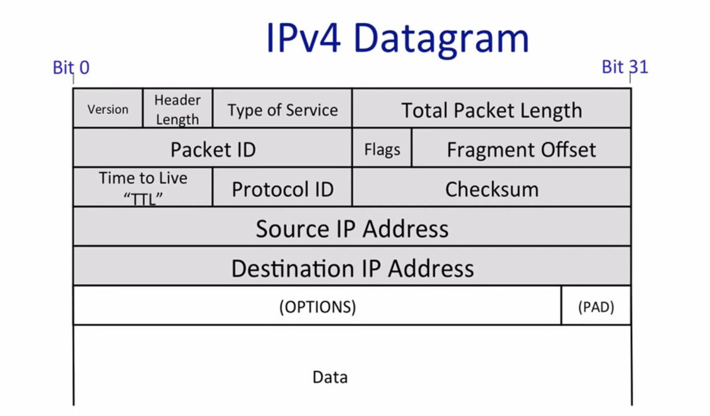

## 从 ipv4 报文到 iptable

---

**以下内容大多基于油管上的金枪鱼之夜：坏人的 iptable 课堂**

我们先来看最熟悉不过的 ipv4 报文结构：



- version: 代表版本，既然我们都在讨论 ipv4 了，那么一般就是 4 了。

- header length: 记录头部的长度，对于我们的 iptable 其实作用不大

- Type of Servie: 非常幽默的一个东西，可以理解为该数据包的重要程度，反正就是可以告诉路由器该数据包的优先级以及需要的服务质量，但是大家都在这上面做文章，所以大家优先级都很高，于是大家优先级都不高（

- Packet ID: 用于标识不同的数据包，由于不同链路上可传输的数据包大小不同，传输过程中就很有可能发生拆分，而拆分后到了目的地该如何组装呢，就是依靠 packet id 标识。

- Flags : 也是于数据包是否分片有关，分别存在 DF 和 MF 的对应位，DF(DO NOT FRAGMENT)是让路由器不要分片，需要分片就返回一个错误消息，一般用于探测；MF(MORE FRAGMENT)代表后面是否还存在已分片的包 ，与 Packet id 结合使用。

- TTL：time to live ， 比较重要的一个点，也就是数据包最多可以经过多少跳，超出就丢掉，有效的避免了自传自乐的 loop 状态。

- Protocol id：传输协议是什么，常见的有 tcp 和 udp 对应的编号。

- Check sum ：校验和，用于校验数据包是否有缺失受损，不是很重要。

- S、D addr：顾名思义，源地址和目的地址

- Data ： 携带的数据，比如上一层应用层 http 中的内容。

  

---

上述的内容为我们构建了最基本的 ipv4 轮廓。但是我们需要了解流量的转发就避不开 iptable。

###  iptables 基本概念

- **定义**：  
  当路由器需要检查数据包内容以决定是否转发时，它就成为防火墙，而 `iptables` 是实现防火墙功能的重要工具，所以我们无论是在谈论 ufw 抑或是 firewall，其实都是在 iptable 上做文章。
- **效率**：  
  相较于路由表，`iptables` 的规则是按顺序执行的，可能效率较低。
- **与路由表对比**：  
  - `iptables`：规则有序执行。
  - 路由表：规则无序，基于最长匹配原则。

---

###  iptables 的表（Tables）
- **`filter` 表**（默认表）：  
  - 用途：过滤数据包。  
  
  - 操作：`ACCEPT`（允许）、`REJECT`（拒绝）、`DROP`（丢弃）。  
  
    可以理解为用来禁某些 ip 的数据包。
  
- **`nat` 表**：  
  - 用途：网络地址转换（NAT）。  
  
  - 操作：`SNAT`（源地址转换）、`DNAT`（目的地址转换）、`MASQUERADE`（伪装）。
  
    nat 转换，记录了转换的对应，内网ip与外网ip形成键值对  
  
- **`mangle` 表**：  
  
  - 用途：修改数据包字段（如 TTL、TOS）。  
  - 场景：高级网络配置和调试。  
  
- **`raw` 表**：  
  - 用途：配置连接跟踪豁免规则。  
  - 时机：在连接跟踪之前处理。  
  
- **`security` 表**：  
  - 用途：强制访问控制（MAC），如 SELinux 策略。  
  - 时机：在 `filter` 表之后处理。

---

### 3. iptables 的链（Chains）
#### 内置链，也就是表各自有哪些链来对应
- **`filter` 表**：  
  - `INPUT`：处理进入本机的数据包。  
  - `OUTPUT`：处理从本机发出的数据包。  
  - `FORWARD`：处理经过本机转发的数据包。  
- **`nat` 表**：  
  - `PREROUTING`：进入路由决策前处理（如 DNAT）。  
  - `POSTROUTING`：离开本机前处理（如 SNAT）。  
  - `OUTPUT`：本机发出并需 NAT 的数据包。  
- **`mangle` 表**：  
  - `PREROUTING`、`INPUT`、`FORWARD`、`OUTPUT`、`POSTROUTING`：修改数据包字段。  
- **`raw` 表**：  
  - `PREROUTING`、`OUTPUT`：连接跟踪前处理。  
- **`security` 表**：  
  - `INPUT`、`OUTPUT`、`FORWARD`：强制访问控制。

#### 用户自定义链
- 用户可创建自定义链，从内置链或其他自定义链中调用。

#### 链的协作
- `PREROUTING` 和 `POSTROUTING` 是 `nat` 表核心链。
- 不同表的链协同工作以实现复杂功能。

---

## 图表分析：

在看对应的语法前我们可以看大致流程：

```
[Incoming Packet]
       |
       v
+----------------+
|  PREROUTING    |  (TTL - 1, Checksum)
|  (in)          |  
+----------------+
       |
       v （判断是否是发往本机的）
+----------------+       +----------------+
|  Routing       | ----> |  FORWARD       | ----> [Outgoing Packet]
|  Decision (R)  |       |  (R)           |
+----------------+       +----------------+
       |                       ^（forward 用于转发，常用于filter表）
       |                       |
       v                       |
+----------------+             |
|  INPUT         |             |
|  (in)          |             |
+----------------+             |
       |                       |
       v                       |
[Local Process]                |
       |                       |
       v                       |
+----------------+             |
|  OUTPUT        |             |
|  (out)         |             |
+----------------+             |
       |                       |
       v                       |
+----------------+             |
|  POSTROUTING   | ------------+
|  (out)         |
+----------------+
       |
       v
[Outgoing Packet]
```


### 4. iptables 语法与操作

- **默认表**：`filter` 表。
- **基本语法**：  
  ```
  iptables [选项] 链名 匹配规则 [match] 动作 [action]
  ```
  - 小写（如 `-s`）：匹配规则。
  - 大写（如 `ACCEPT`）：动作。
- **常用选项**：  
  - `-P`：设置链的默认策略（如 `iptables -P FORWARD DROP`）。  
  - `-I`：插入规则（如 `iptables -I FORWARD 1 ...`）。  
  - `-R`：替换规则。  
  - `-C`：检查规则是否存在。  
  - `-L`：列出链的所有规则。  
- **匹配规则（match）**：  
  - `-i`：匹配进接口。  
  - `-o`：匹配出接口。  
  - `-s`：匹配源地址（支持 CIDR 格式，如 `192.168.1.0/24`）。  
- **动作（action）**：  
  - 可使用自定义链作为动作。

---

### 5. iptables 与网络字段
- **可操作的 IPv4 字段**：  
  - `src`（源地址）：用于匹配或 NAT。  
  - `dst`（目的地址）：用于匹配或 NAT。  
  - `tos`（服务类型）：可在 `mangle` 表修改。  
  - `ttl`（存活时间）：可在 `mangle` 表修改，路由器每跳减 1。  
- **TTL 在 Link 内**：  
  - 在同一链路（Link）内，TTL 不会减少，只有经过路由器才会减 1。

---

### 6. iptables 的高级功能
- **负载均衡**：  
  - 通过 `statistic` 模块实现。  
  - 注意：规则按顺序执行，错误配置可能丢包（如 0.8 分流后，剩余流量再按 0.2 分流会导致丢包）。  
  - 前提：NAT 基于连接跟踪，确保包不乱发。  
- **典型应用**：  
  - OpenWrt 前端界面基于 `iptables`。

---

### 7. 注意事项
- **双向配置**：  
  - 配置网络时需考虑回程路径，避免只配单向导致不通。  
- **连接跟踪**：  
  - NAT 和负载均衡依赖连接跟踪（connection tracking）。  
- **与 traceroute 的关系**：  
  - `traceroute` 利用 TTL 为 0 时路由器返回的 ICMP 错误消息。

---

### 8. 相关网络概念
- **Node**：实现 IP 协议的服务器。  
- **Router**：转发非发给自己的包的节点。  
- **Host**：只处理发给自己的包的节点。  
- **Link**：无需路由器即可互通的网络范围（如以太网）。  
- **Interface**：网卡或接口，与 Link 连接。  
- **路由选择**：  
  - 数据包进入 Interface 后，路由表决定转发路径。  
  - `iptables` 通过 5 个钩子（PREROUTING、INPUT、FORWARD、OUTPUT、POSTROUTING）介入处理。

---

### 9. iptables 与路由表的对比
- **iptables**：  
  - 有序规则执行，效率较低。  
  - 功能强大，支持过滤、NAT、修改字段等。  
- **路由表**：  
  - 无序匹配，基于最长匹配原则（如 `1.2.3.0/24` vs `1.2.3.0/25`）。  
  - 专注于快速转发。


本来一开始写的很零散，最后让 gpt 帮忙整理后就成了序号明确的 md 文件了，就是 ai 味太浓了点...
